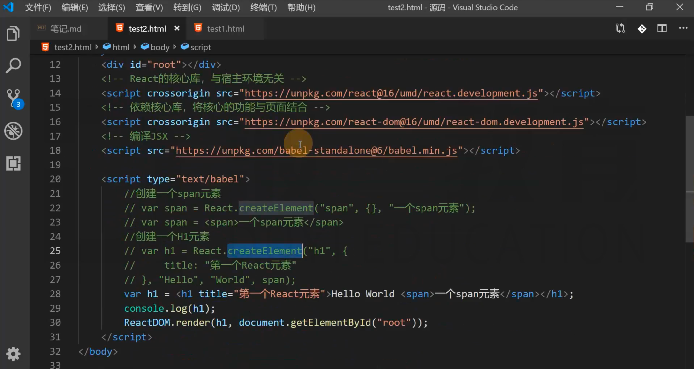

# Hello World

直接在页面上使用 React，引用下面的 JS

```html
<script crossorigin src="https://unpkg.com/react@16/umd/react.development.js"></script>
<script crossorigin src="https://unpkg.com/react-dom@16/umd/react-dom.development.js"></script>
<script src="https://unpkg.com/babel-standalone@6/babel.min.js"></script>
```

`crossorigin` 为了当错误发生的时候，能够提供更加详细的错误信息。
如果没有加上这个属性，那么当出现跨域错误时，只会展示一些简单的错误信息。


## React.createElement

创建一个 React 元素，称作虚拟 DOM，本质上是一个对象。

1. 参数1：元素类型，如果是字符串，一个普通的 HTML 元素
2. 参数2：元素的属性，一个对象
3. 后续参数：元素的子节点

## JSX

JS 的扩展语法，需要使用 babel 进行转义。

> JSX 是 Facebook 提出的一种语法规则，但是 es 官方并没有实现这种写法，并没有纳入 es 标准。


