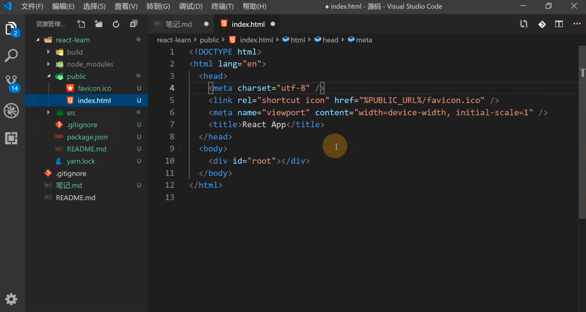
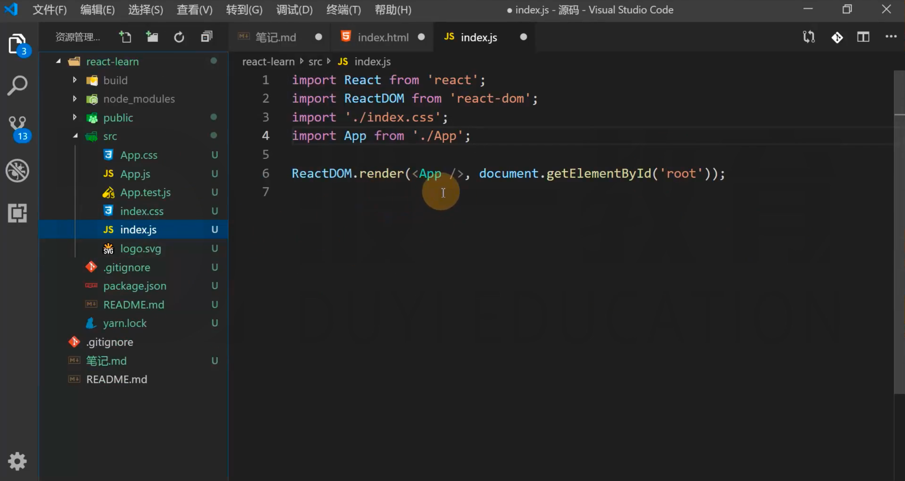
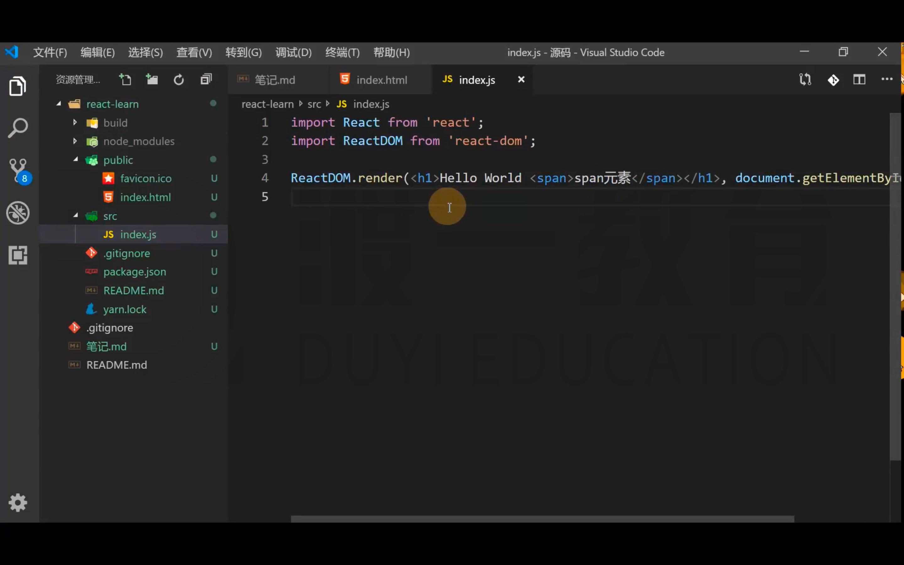
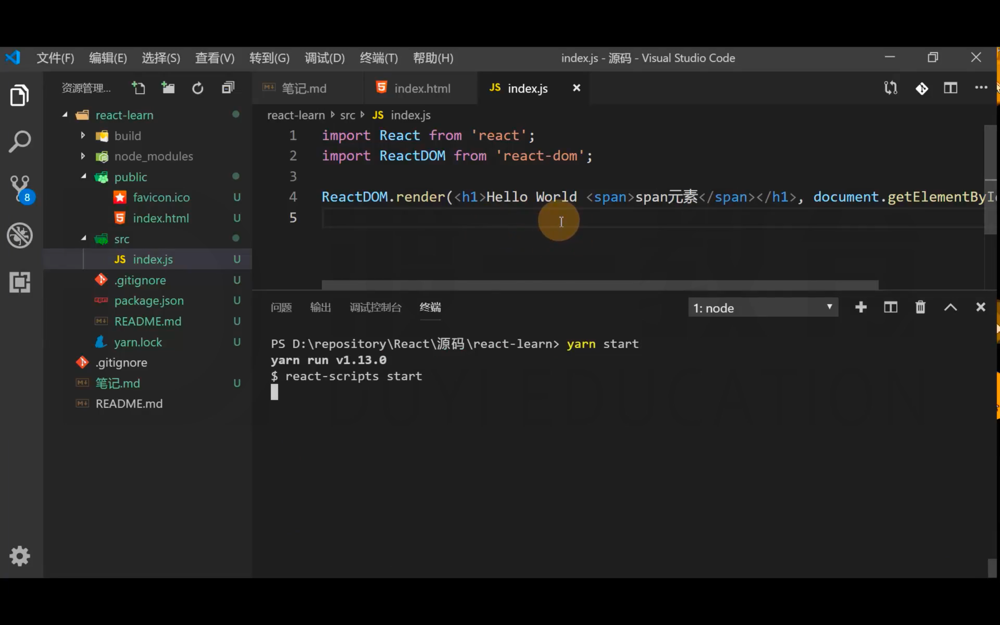
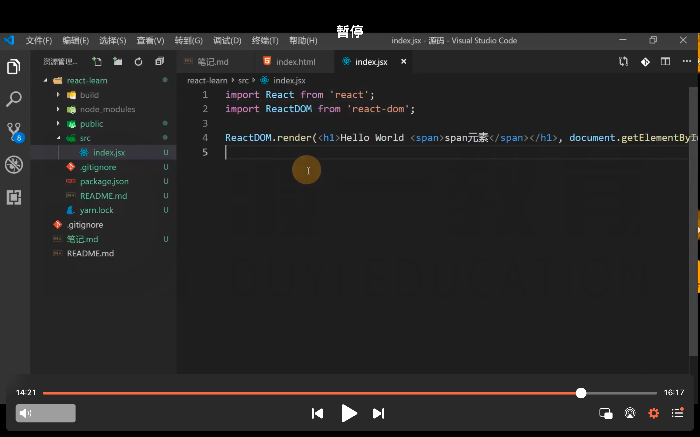

# 使用脚手架搭建工程

官方：create-react-app
第三方：next.js、umijs

凡是使用JSX的文件，必须导入React

不需要的东西，直接删掉即可，那些东西暂时都用不到。

凡是使用JSX的文件，必须导入React
虽然在 index.js 中，并没有直接使用 React 包，但是如果没有它，那么我们写的 JSX 是没法转为 React 虚拟 DOM 的。
在运行的时候，需要用到 React 这个包，所以不要删掉。

找时间回顾一下 yarn 的相关内容
平时使用的都是 npm，现在正好乘着袁老在讲解 react 时使用 yarn，了解一下 yarn 的一些用法

对于文件的后缀名，可以是 js、也可以是 jsx，在 React 工程中，这两种后缀名都是支持的。

