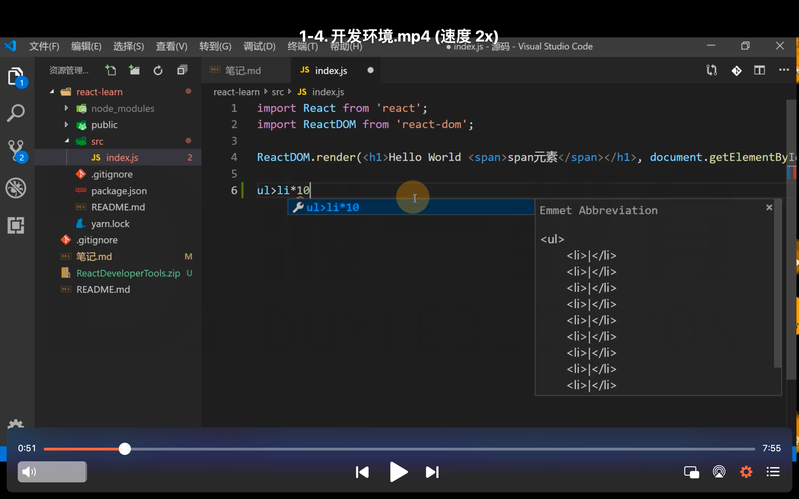
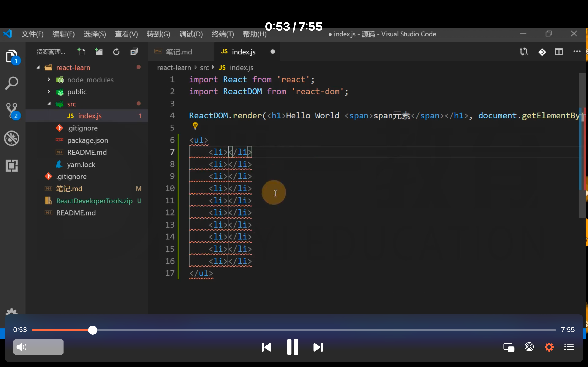
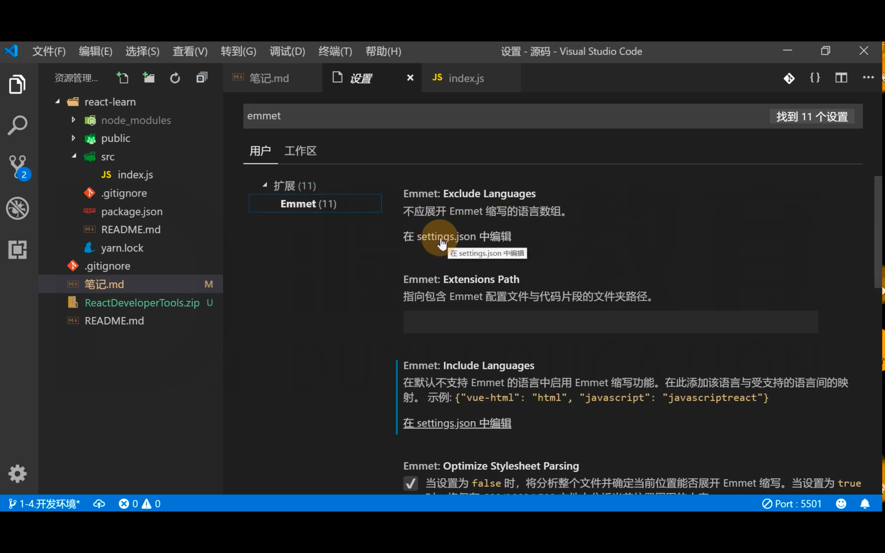
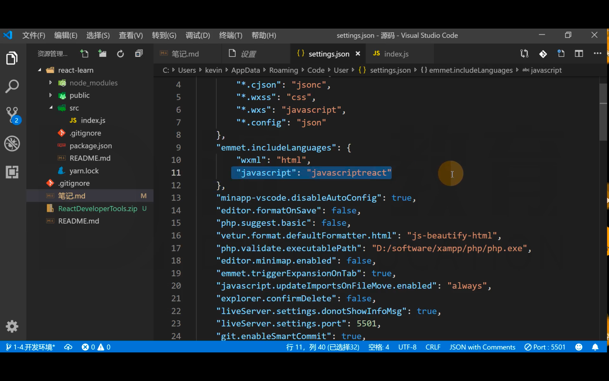
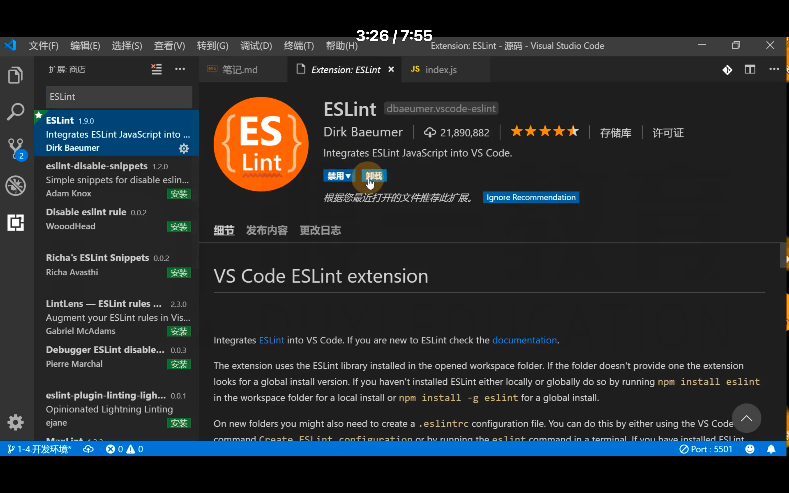
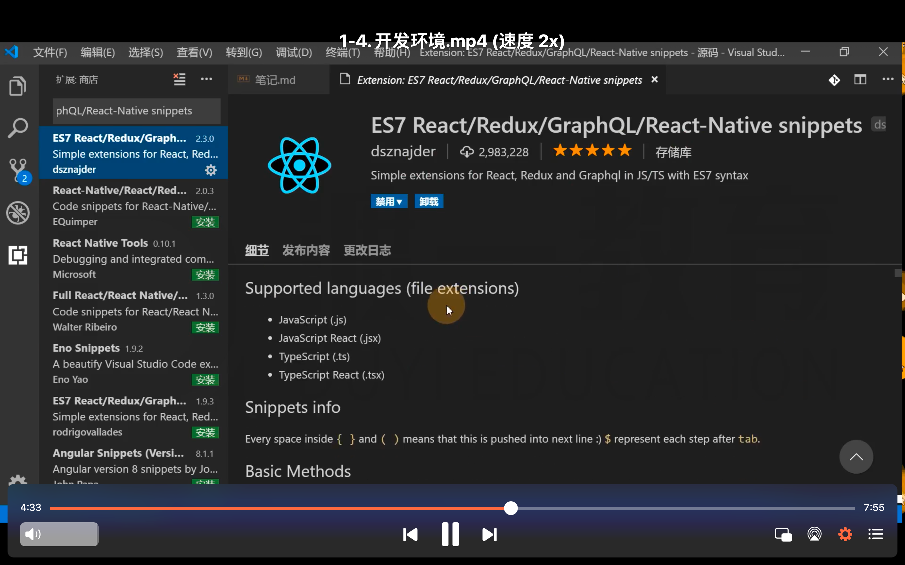
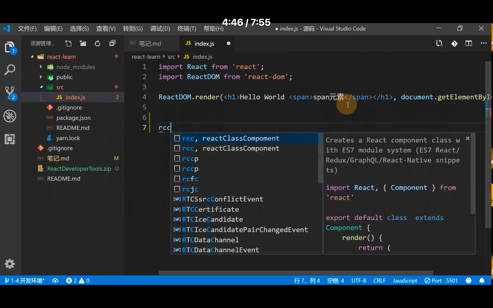
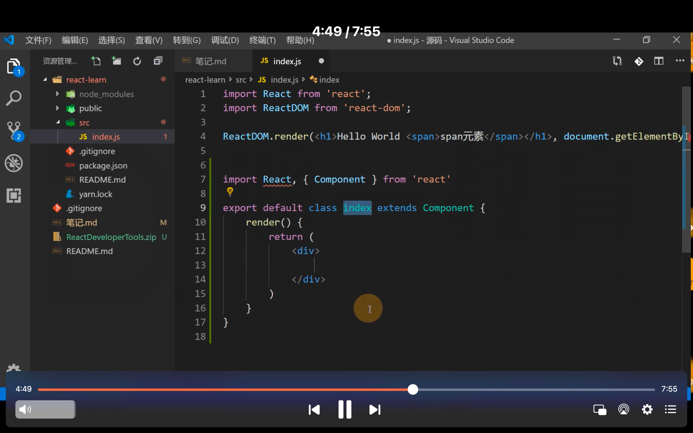
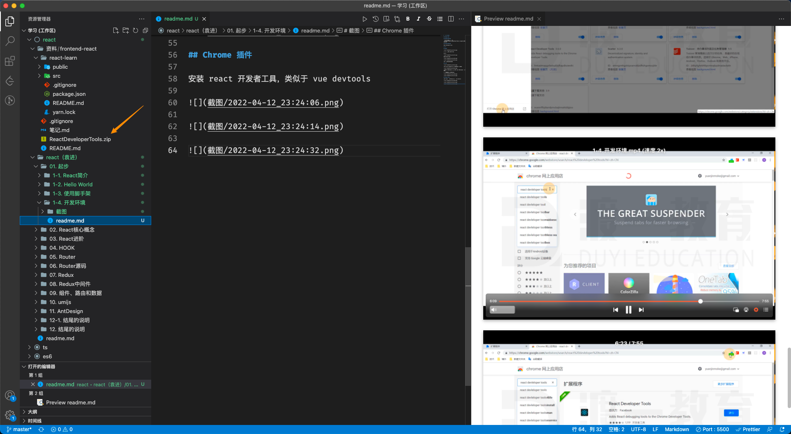

# 开发环境搭建

## VSCode配置

emmet配置：

```json
"javascript": "javascriptreact"
```

## VSCode插件安装

- ESLint：代码风格检查
- ES7 React/Redux/GraphQL/React-Native snippets：快速代码编写

## Chrome插件安装

React Developer Tools

# 截图

## emmet



在 js 中也支持 emmet 语法

效果：



需要做以下配置：





只要加上这条语句即可。

## 插件



安装 eslint 的目的：让我们写的代码更加规范。



安装这个插件的目的，为我们编写 react 代码，提供一些代码片段速写。

用于快速生成通用的代码片段





## Chrome 插件

安装 react 开发者工具，类似于 vue devtools


> 对于不能翻墙的小伙伴，可以使用袁老提前 download 下来的安装包，不过这个版本应该不是最新的。

