# 组件状态

组件状态：组件可以自行维护的数据

组件状态仅在类组件中有效

状态（state），本质上是类组件的一个属性，是一个对象

> 组件状态仅在类组件中有效
> 这种说法并不准确，若是在函数组件中，也是可以通过 hook 来实现的，至于 hook 的相关内容，后续在 「04. HOOK」 中会介绍到。
> 这里之所以这么说，是因为在本节介绍的内容中，仅考虑类组件的情况，不考虑函数组件的情况。

**状态初始化**

在 constructor 中，给 this.state 赋初值。

**状态的变化**

不能直接改变状态：因为React无法监控到状态发生了变化

必须使用this.setState({})改变状态

一旦调用了this.setState，会导致当前组件重新渲染

初始化：this.state = 对象1
重新渲染：this.setState(对象2)
当重新渲染时，会先将对象1与对象2合并，然后根据合并后的状态来渲染。
合并后的对象：{ ...对象1, ...对象2 }

> this.render(); // ×
> 重新渲染，不能通过重新调用 render 方法来实现。

**组件中的数据**

1. props：该数据是由组件的使用者传递的数据，所有权不属于组件自身，因此组件无法改变该数据
2. state：该数组是由组件自身创建的，所有权属于组件自身，因此组件有权改变该数据

|                                              | props | state |
| -------------------------------------------- | ----- | ----- |
| Can get initial value from parent Component? | Yes   | Yes   |
| Can be changed by parent Component?          | Yes   | No    |
| Can set default values inside Component?*    | Yes   | Yes   |
| Can change inside Component?                 | No    | Yes   |
| Can set initial value for child Components?  | Yes   | Yes   |
| Can change in child Components?              | Yes   | No    |

> **🤔 「组件C」只被「B组件」调用，那么「组件C」获取到的属性数据是属于「组件B」的，思考这句话是否正确？**
> 答：❎
>
> 假设当前的组件调用结构是：root -> A -> B -> C
> 此时只能说「组件C」的属性数据肯定不是自己的，它可能属于上级任一组件，root、A、B 都有可能。「组件B」仅仅是起到了一个连续传递的作用。

# 截图

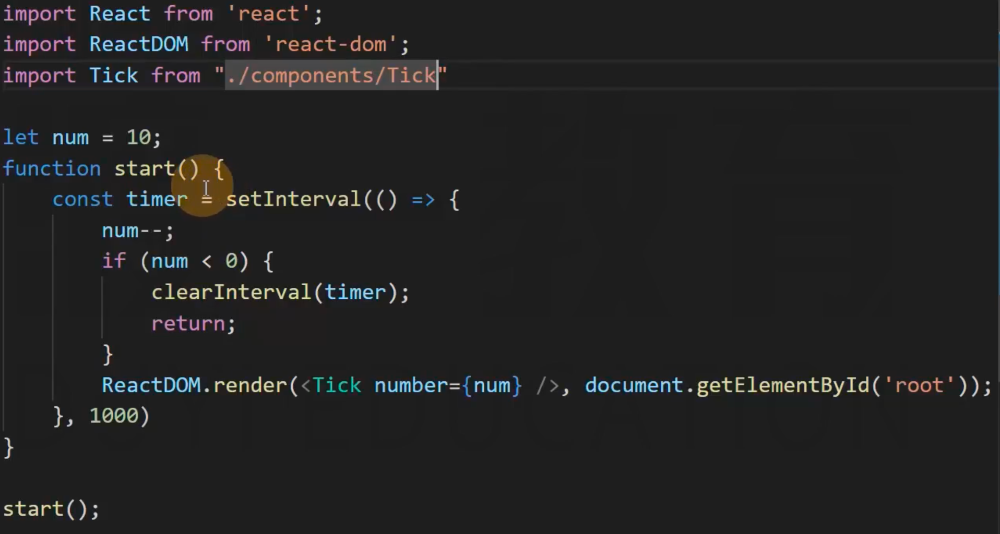

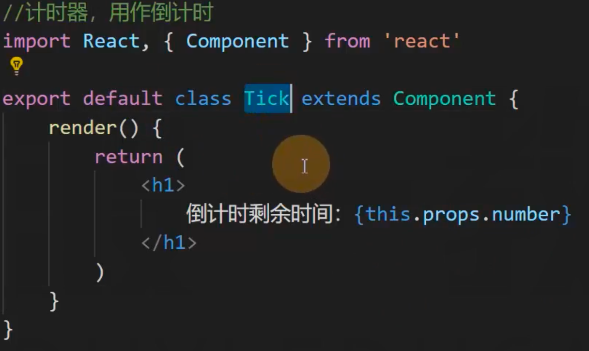

对于 Tick 组件，它的功能就是提供一个倒计时功能，需要维护的数据就只有一个：倒计时的时间。

维护倒计时的时间
1. 通过属性传递来维护
2. 通过状态来维护

如果 xxx 组件某个数据，需要在调用组件时才能明确，那么需要在调用组件时，通过参数传递的方式来明确。

如果 xxx 组件某个数据，维护工作可以在组件内轻松地完成，那么完全可以将该数据丢给组件自身来维护，也就是将其丢到组件的状态中。

上述 codes 中的做法，显然是不合理的，倒计时的时间可以由调用的时候，通过参数传递的方式来确定。

但是对于倒计时变量的维护工作，完全可以丢给 Tick 组件自身去做。

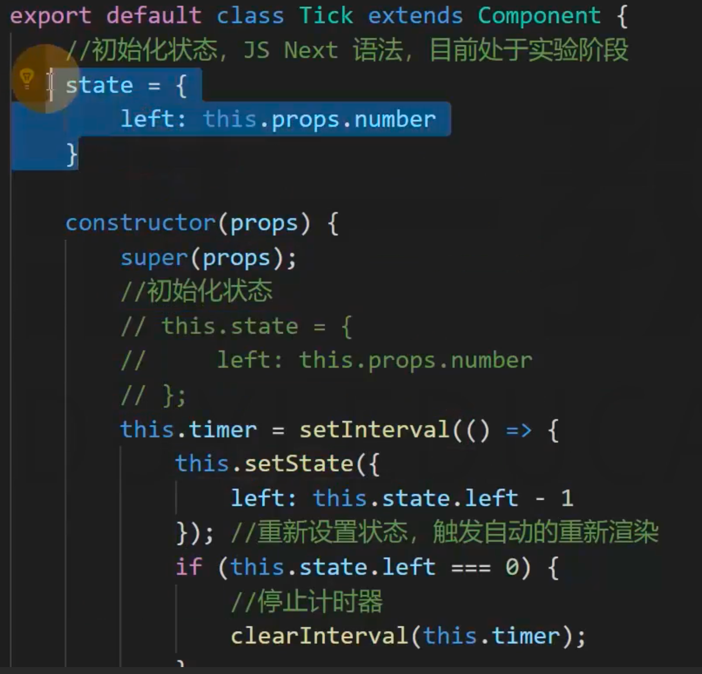

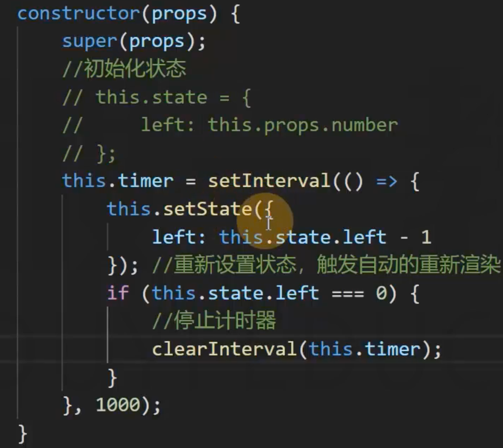

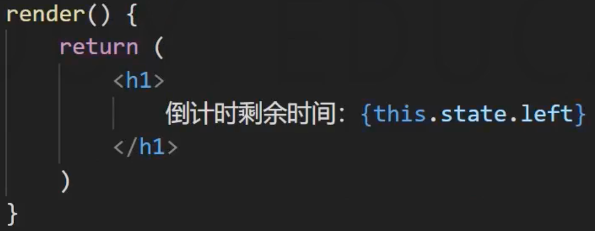

---

重新渲染的问题

组件A
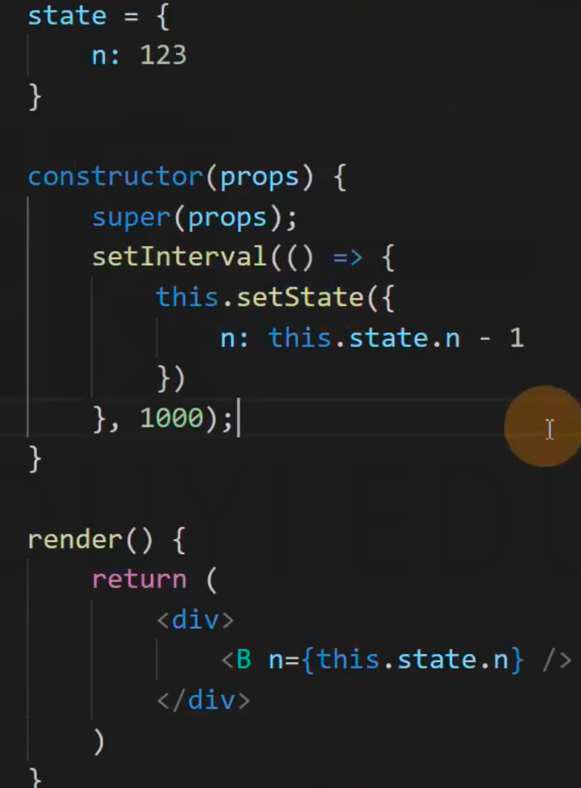

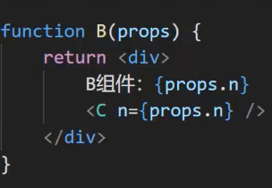
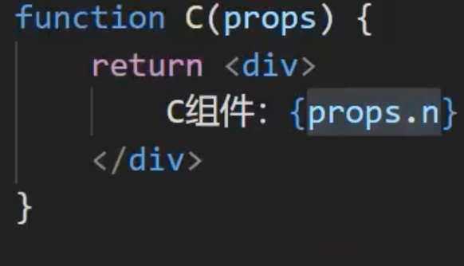

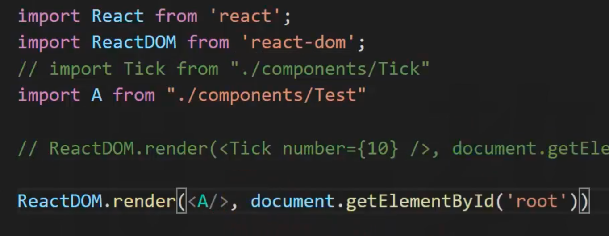

在页面上将 A 组件给渲染出来，由于 setState 会导致重新渲染，所以B、C都会跟着重新渲染

可以通过开发者工具来查看重新渲染的组件

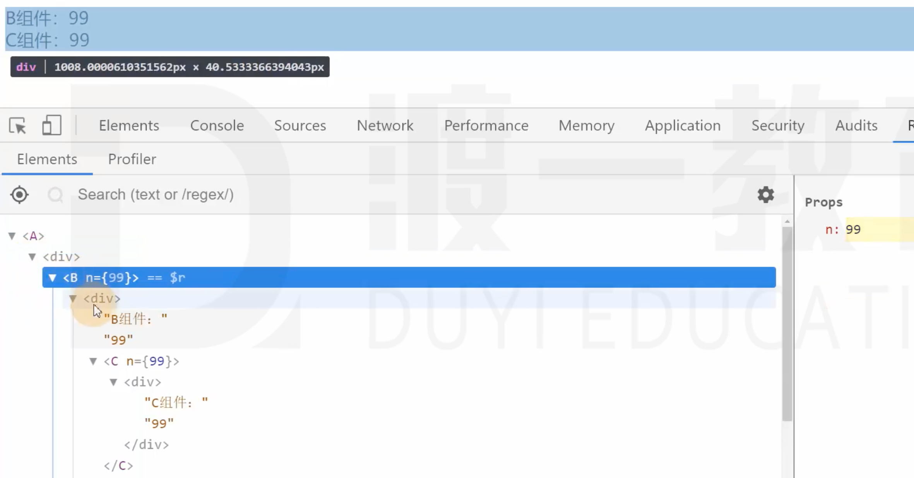

可以很直观地查看到当前的组件结构

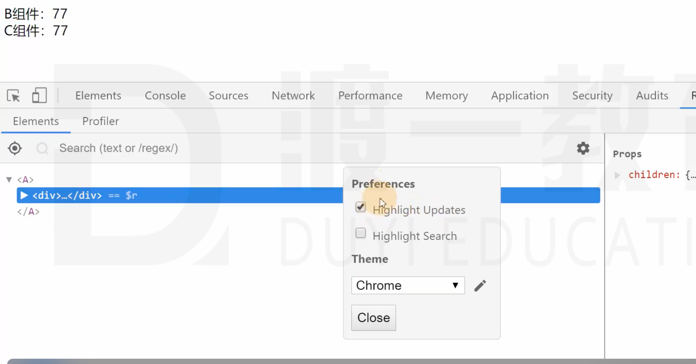

高亮显示重新渲染的组件

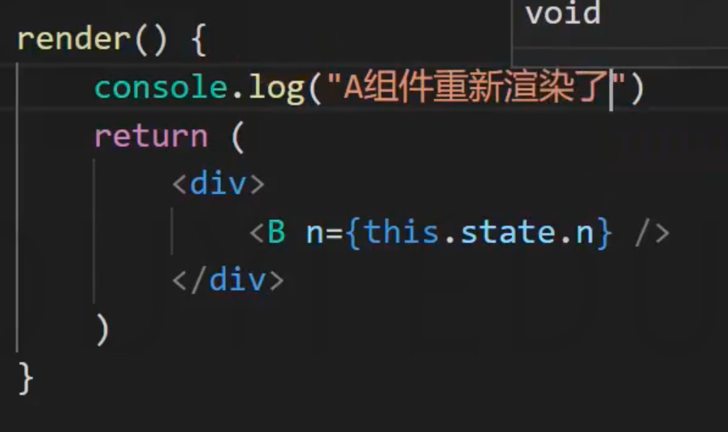

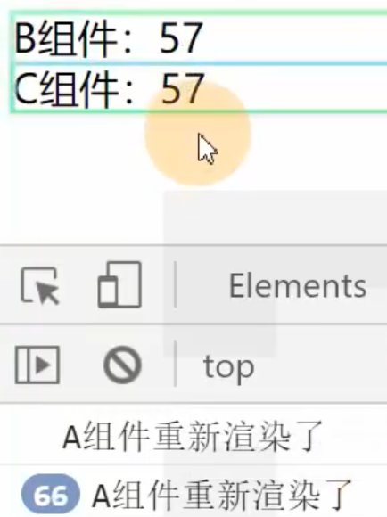

 
 
 
 
 
 
 
 