# 事件

在React中，组件的事件，本质上就是一个属性

按照之前React对组件的约定，由于事件本质上是一个属性，因此也需要使用小驼峰命名法

**如果没有特殊处理，在事件处理函数中，this指向undefined**

1. 使用bind函数，绑定this
2. 使用箭头函数

# 截图

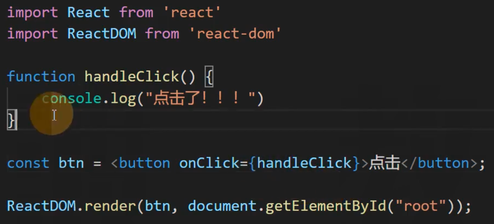

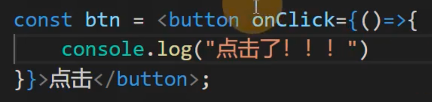

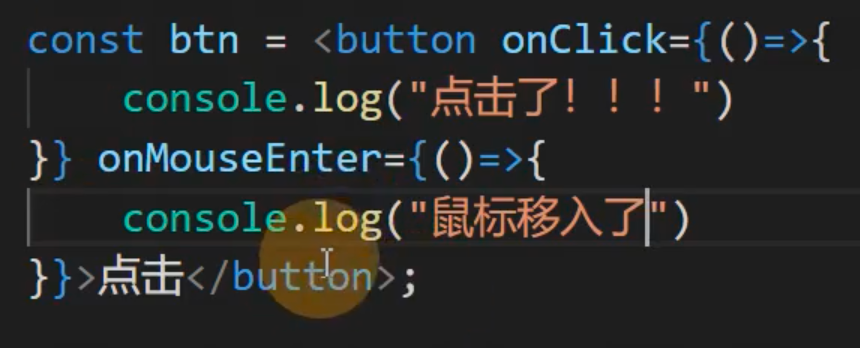

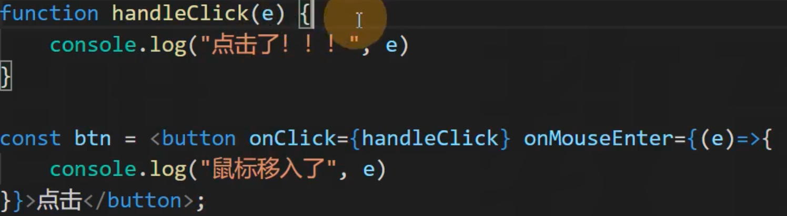

上面介绍了内置组件如何添加事件，下面介绍如何在自定义组件上添加事件。

> 内置组件，就是 react 中内置的一些和 html 元素相同的组件。
> 比如：`<button></button>` `

`

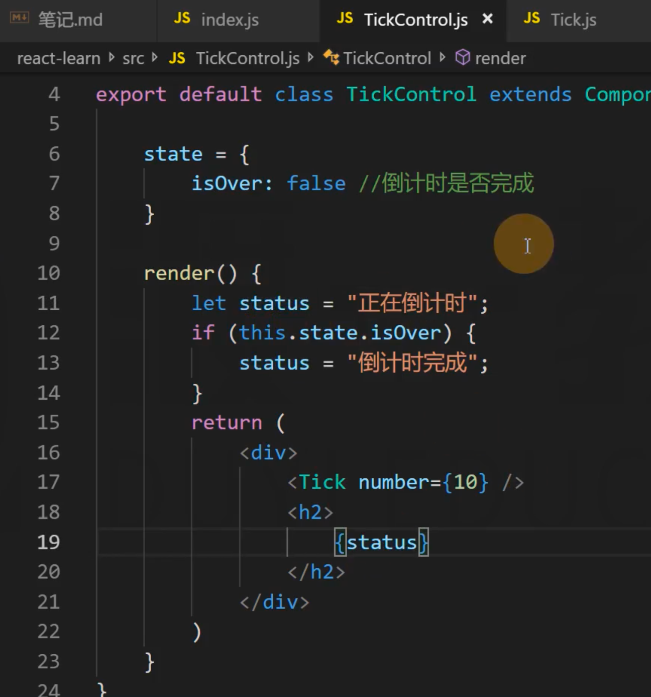

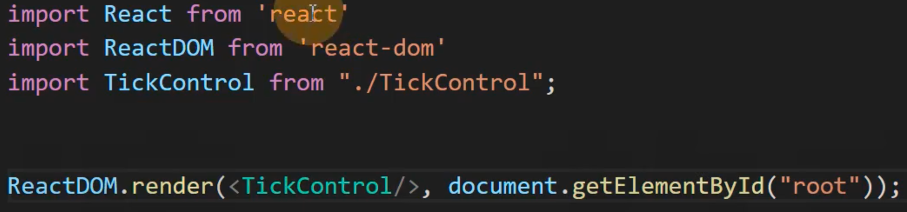

1. Tick 组件，知道倒计时啥时候结束。
2. TickControl 组件，知道倒计时结束之后需要做什么。

**事件**

如果是在 vue 中，逻辑如下：

1. Tick 组件，当倒计时结束时，抛出一个事件 over，通知 TickControl 组件。
2. TickControl 组件，调用 Tick 组件，并绑定 over 事件处理函数 handleOver，当倒计时结束时，该事件处理函数就会运行。

如果是在 react 中，逻辑如下：

1. TickControl 组件，调用 Tick 组件，给属性（事件） onOver 赋值，赋的值是一个函数 handleOver，表示当倒计时结束后需要执行的事件处理函数。
2. Tick 组件，读取到传递过来的 onOver 属性，当倒计时结束时调用该属性（事件）。

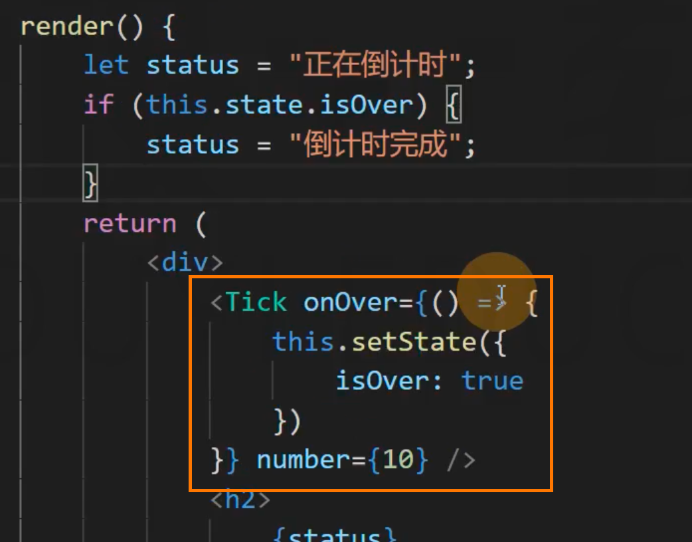

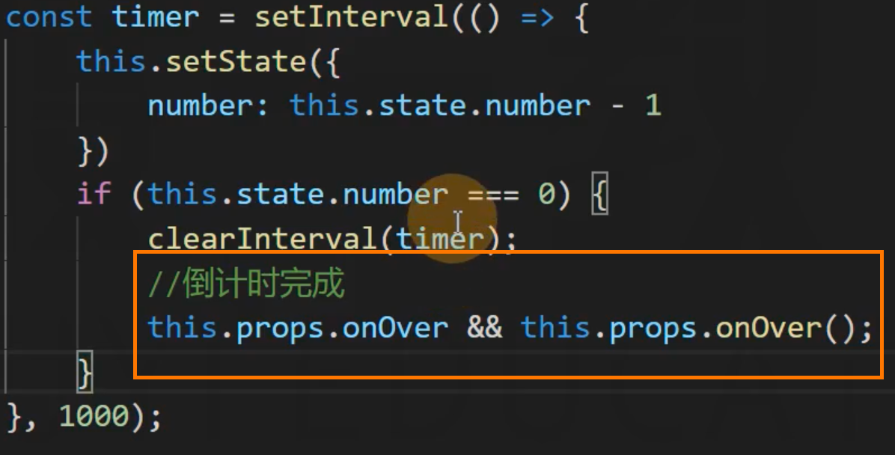

下面介绍 this 的绑定问题

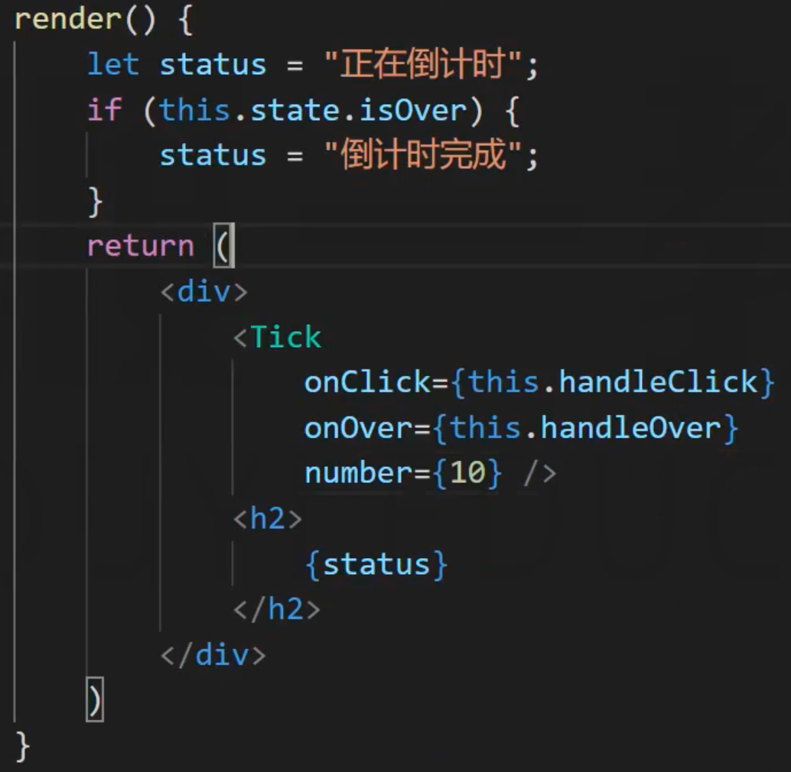

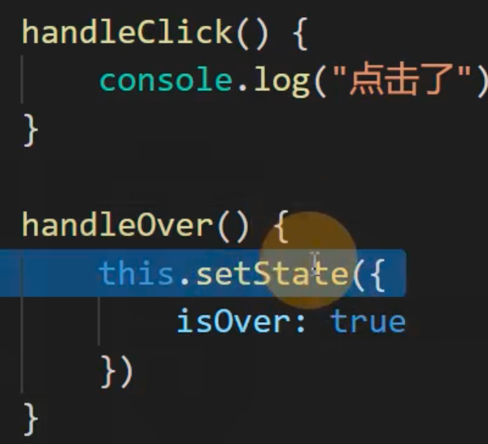

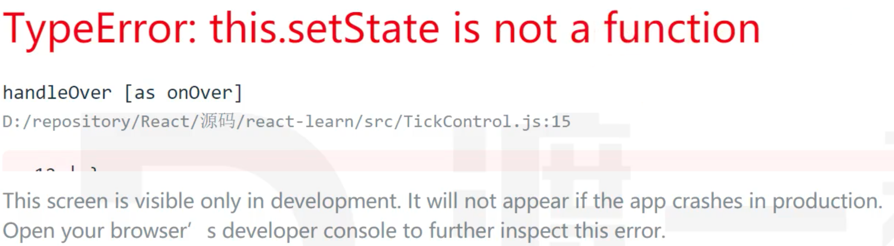

因为默认情况下，事件处理函数中的 this 指向 undefined

箭头函数中的 this，默认是指向当前位置的 this，所以之前的 codes 并没有出现报错。

可以使用 bind api 来绑定 this。

常见写法1：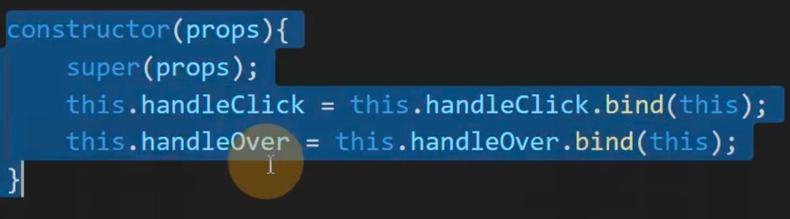

常见写法2：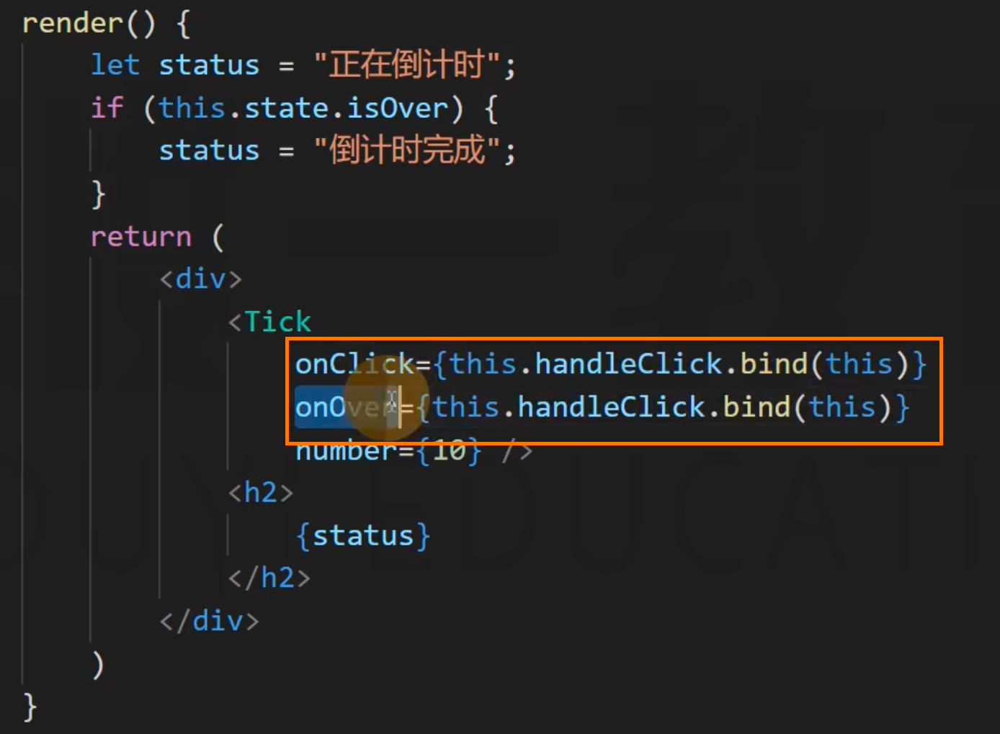

**对比写法1、2**

写法1 写起来麻烦一些，但是效率更高。

写法2 写起来简单一些，但是效率偏低。
因为每次重新渲染时，都要调用 this.xxx.bind(this)，调用 bind 会返回一个新的函数，相当于每次重新渲染，就要新建函数。

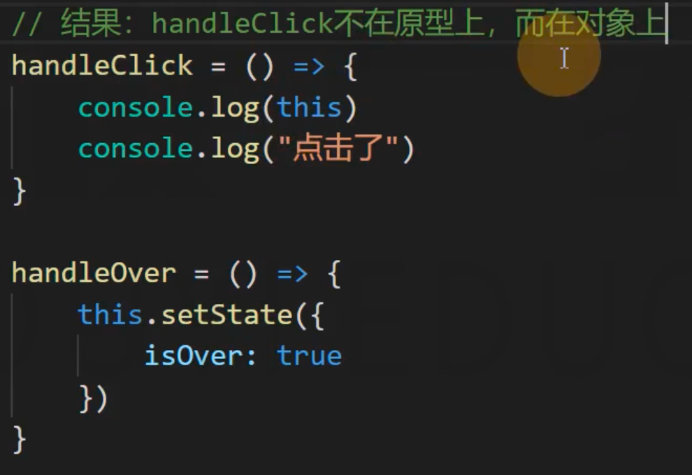

常见写法3：通过箭头函数的形式来解决 this 指向问题。

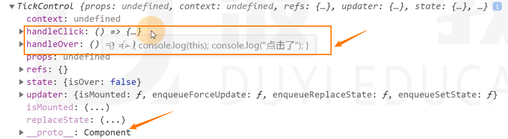

这种做法会将 handleClick、handleOver 添加到实例身上，而不是添加到原型上。

**对比写法1、3**

写法1：麻烦，不仅会将事件处理函数添加到实例上，还会添加到原型上；
写法2：简单，只会将事件处理函数添加到实例上；

 
 
 
 
 
 
 
 
 
 
 
 
 
 
 
 