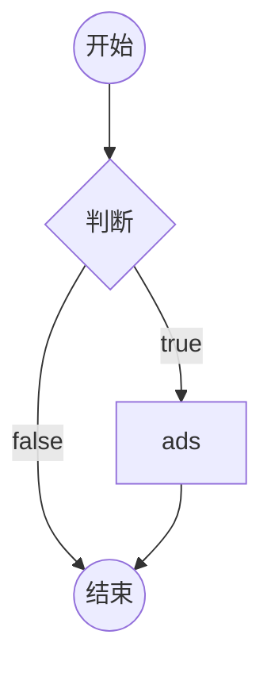
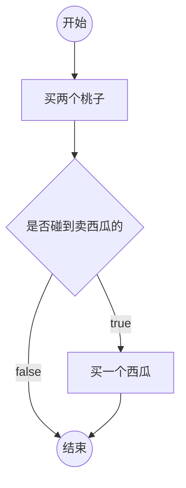
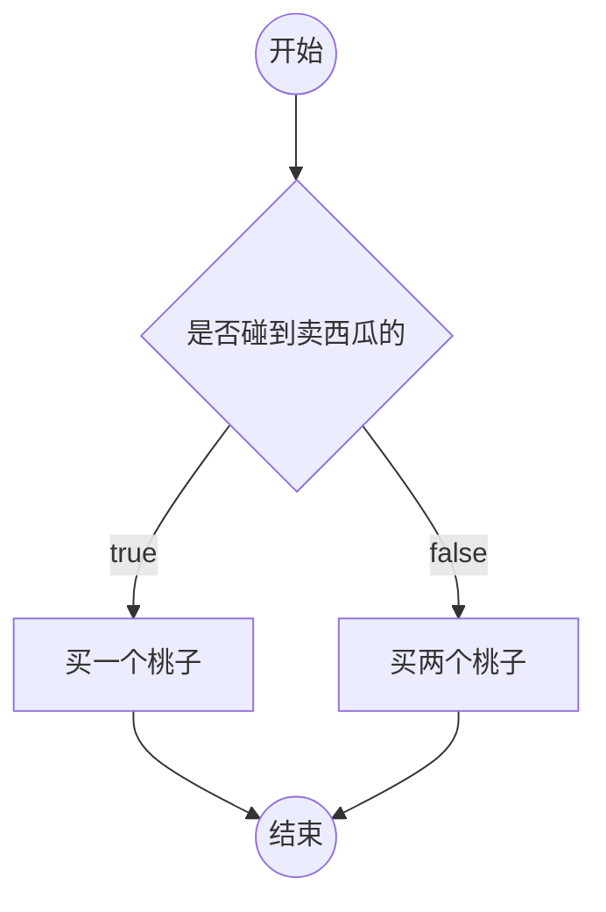
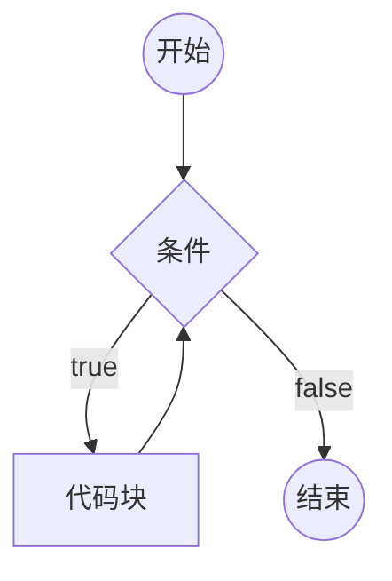
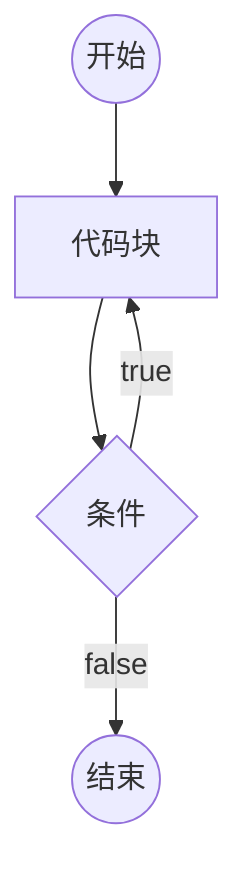
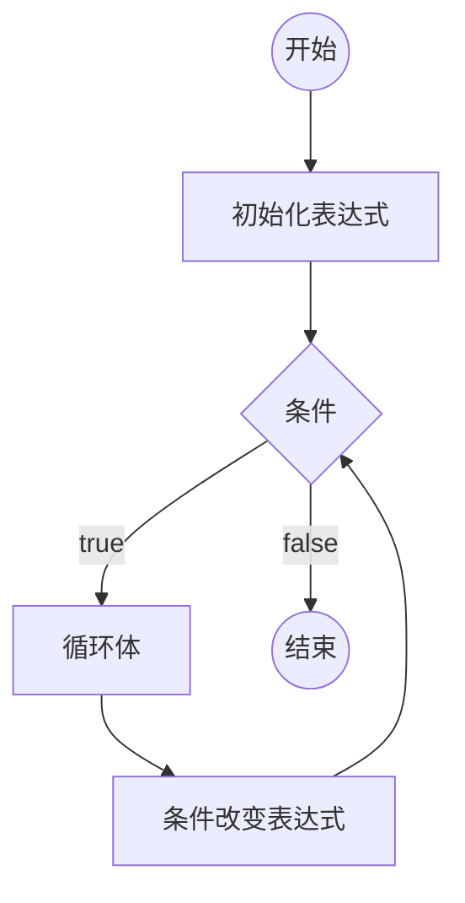

# 4. 流程控制 {ignore}

[toc]

## 4-1. 流程图

- 流程图是啥？
  - 一套标准的图形，用于描述程序的逻辑，通常使用流程图来分析程序的流程。
  - 相关符号：
- 如何在 markdown 中绘制流程图？
  - `mermaid`
  - 很简单，自行百度即可。

---

- [x] 在 markdown 中画流程图的基本语法

```
graph TD
start((开始))-->if{判断}
if{判断}--true-->A[ads]
if{判断}--false-->ed((结束))
A-->ed
```



- [x] 邓哥的思维：

```
graph TD
st((开始)) --> buyPeach[买两个桃子]
buyPeach-->if{是否碰到卖西瓜的}
if--true-->buyXigua[买一个西瓜]
if--false-->ed((结束))
buyXigua-->ed
```



<!--  -->

- [x] 成哥的思维：

```
graph TD
st((开始)) --> if{是否碰到卖西瓜的}
if--true-->买一个桃子
if--false-->买两个桃子
买一个桃子-->ed((结束))
买两个桃子-->ed
```



<!--  -->

## 4-2. if判断

```js
if (条件1) {
  // 代码块
}
else if (条件2) {
  // 代码块
}
else if (条件3) {
  // 代码块
}
//....
else {
  // 以上条件都不满足执行的代码块
}
```

- 如果某个条件满足，则直接忽略后面的所有条件；
- else if 可以有多个，也可以没有；
- else 可以有 1 个或 0 个；
- else 可以换行，可以不换行；（看公司要求，若公司没强制要求，就看个人习惯。）
- 如果代码块只有一条语句，可以省略花括号；（不推荐）
- if 只能出现一次

---

【补充】

- `prompt("提示文本");` 该表达式的结果有两种情况：
  - 若用户点击的是**确定**，那么会**以字符串形式返回用户输入的内容**；
  - 若用户点击的是**取消**，那么返回 `null`；
- 利用 操作符 `+` 可以将字符串转换成数字
  - `+字符串`
  - `+字符串` 等价于 `Number(字符串)`
    - `+"1"; // => 1`
    - `Number("1"); // => 1`
- 得到一个随机数
  - `Math.random()`
  - 该表达式返回一个 0~1 之间的随机数字（无法取到1）


## 4-3. [作业讲解]if判断


### 作业1

- [x] 1. 提示用户输入一个三位数，若不是三位数，则提示用户输入有误；若是三位数，则判断该数能否被13整除。

```js
var number = +prompt("请输入一个三位数");
if (isNaN(number) || number < 100 || number > 999) {
  console.log("输入有误");
} else {
  if (number % 13 === 0) {
    console.log("能被13整除")
  } else {
    console.log("不能被13整除")
  }
}
```

### 作业2

- [x] 2. 让用户输入一个成绩（0-100），判断这个成绩属于哪个范围并输出结果（A:90-100 B:70-89 C:60-69 D:40-59 E:0-39），若用户输入的不是0-100的数字，则输出输入有误。

```js
var score = +prompt("请输入一个成绩（0~100）");
if (isNaN(score) || score < 0 || score > 100) {
  console.log("输入有误");
} else {
  if (score >= 90) {
    console.log("A")
  } else if (score >= 70) {
    console.log("B")
  } else if (score >= 60) {
    console.log("C")
  } else if (score >= 40) {
    console.log("D")
  } else {
    console.log("E");
  }
}
```

### 作业3

- [x] 3. 根据世界卫生组织推荐的计算方法，
    男性标准体重计算方法为（身高cm－80）×70﹪
    女性标准体重计算方法为（身高cm－70）×60﹪
    标准体重正负10%为正常体重，低于标准体重的10%为过瘦，高于标准体重的10%为过重
    编写程序，让用户输入性别、身高、体重，判断用户的健康状况

    健康状况有3种：

    1) 你的体重正常，请继续保持
    2) 你的身体偏瘦，请加强营养
    3) 你的身体偏胖，请加强锻炼

```js
var height = +prompt("请输入身高(cm)");
var weight = +prompt("请输入体重(kg)");
var gender = prompt("请输入性别（男，女）");
if (isNaN(height) || isNaN(weight) || gender !== "男" && gender !== "女") {
 console.log("输入有误");
} else {
 var standardWeight; //标准体重
 if (gender === "男") {
   standardWeight = (height - 80) * 0.7;
 } else {
   standardWeight = (height - 70) * 0.6;
 }

 if (weight < standardWeight * 0.9) {
   console.log("你的身体偏瘦，请加强营养");
 } else if (weight > standardWeight * 1.1) {
   console.log("你的身体偏胖，请加强锻炼")
 } else {
   console.log("你的体重正常，请继续保持");
 }
}
```

### 作业4

- [x] 4. 某理财公司推出一种理财服务，服务规则如下：
    若用户的理财金额在50万元以下，则每年的收益按照4%计算。
    若用户的理财金额在50万元以上（包括50万），则每年收益按照4.5%计算。
    若用户的理财金额超过200万，除了理财收益外，还要额外给予用户收益金额的10%
    编写程序，让用户输入理财金额和理财年限，计算到期后的收益

```js
var money = +prompt("请输入理财金额");
var year = +prompt("请输入理财年限");
if (isNaN(money) || isNaN(year) || money <= 0 || year <= 0) {
  console.log("输入有误");
} else {
  var rate = 0.04; // 年利率4%
  if (money >= 500000) {
    rate = 0.045;
  }
  var earnMoney = money * rate * year; // 收益
  if (money >= 2000000) {
    earnMoney += earnMoney * 0.1;
  }
  console.log(`总收益为：${earnMoney}`);
}
```

### 作业5

- [x] 5. 编写一个用户和计算机猜拳的游戏，用户输入剪刀、石头或布，与计算机的出拳进行比较，判断胜负。

```js
var fist = prompt("请出拳（剪刀、石头、布）");
if (fist === "剪刀" || fist === "石头" || fist === "布") {
  //正确
  //1. 模拟计算机出拳
  var rad = Math.random(); // 0~1
  var pcFist; //计算机出拳结果
  if (rad < 0.333) {
    pcFist = "剪刀";
  } else if (rad < 0.6666) {
    pcFist = "石头";
  } else {
    pcFist = "布";
  }
  //2. 比较胜负
  console.log(`你的出拳：${fist}, 电脑出拳：${pcFist}`);
  if (fist === "剪刀" && pcFist === "布" ||
    fist === "布" && pcFist === "石头" ||
    fist === "石头" && pcFist === "剪刀") {
    console.log("你胜利了！");
  } else if (fist === pcFist) {
    console.log("平局");
  } else {
    console.log("电脑胜利！");
  }
} else {
  console.log("输入有误")
}

// if (fist !== "剪刀" && fist !== "石头" && fist !== "布") {
//     console.log("输入有误")
// } else {
//     //正常
// }
```

## 4-4. switch 开关

> 写在前面：开发中很少使用 switch 语句。（甚至有的公司禁止使用）
> 可能是因为 switch 的语法始终可以使用 if结构 替代，所以后面在写项目时，几乎都不会使用 switch 来写。在想到要写分支结构的时候，理所当然地会想到使用 if结构 来实现，而不会想到 switch。
> 不过这可能也跟开发者的习惯有关系，也有可能会有一些人更青睐于使用 switch 来写分支结构。所以，switch语法 还是得了解一下的。

```js
switch(表达式){
  case 数据1:
    代码块
  case 数据2:
    代码块
  //...
  default:
    代码块
}
```

- 执行逻辑：
  - 先计算表达式的返回值；
  - 将得到的结果依次和 case 后面的数据进行严格相等的比较；
    - 若匹配上了，则停止比较，然后运行其内部的代码块，对应 case 中的代码块执行完毕后，switch 语句结束；
    - 若所有 case 都没有匹配上，那么会执行 default 中的代码块。若没写 default，那么 switch 语句结束；
- break
  - 在 case 分支内部，使用 break 语句，可以立即结束 switch 语句。
- default
  - default 在前面的所有 case 都不匹配时运行。
  - 在 switch 语句中，default 是可选的，并不要求一定得写。

## 4-5. 循环

- 什么是循环体？
  - 循环体就是一段代码，可以是一条语句，也可以是多条语句。
- 什么是循环？
  - 循环就是在循环条件满足的情况下，重复的运行循环体。
- 什么是死循环？
  - 死循环就是循环条件永远满足，永远无法退出循环。
- js 中的循环结构都有哪些？
  - JS支持3种循环结构：while循环、do-while循环、**for循环**。
    - 重点在于 **for循环**。
  - 在学习 es6 之前，只接触到这三种循环结构。后面在我们学习过 es6 之后，还会有 `for-in`、`for-of` 循环结构，这些在 es6 会介绍。
- 循环中的关键字有什么作用？
  - 循环控制语句
- 循环中的关键字有哪些？
  - `break;` 跳出循环
  - `continue;` 停止当前循环体，进入下一次循环。

---

- while循环

```js
while (条件) {
  // 代码块（循环体）
}
```



<!--  -->

- do-while循环

```js
do {
  // 循环体
} while (条件);
```



<!--  -->


- for循环

```js
for (初始化表达式; 条件; 条件改变表达式){
  // 循环体
}
```



<!--  -->

## 4-6. 循环应用

- 累计
  - 举例：将1-100的所有数字相加之和。
  - 思路：准备一个变量，初始值为0，然后1-100循环，每次循环，将数字累加到变量中。
- 查找
  - 举例：135~145之间是否存在能整除26的数字。
  - 思路：准备一个变量，记录false，表示没有找到，然后135-145进行循环，如果发现满足条件的数字，重新记录变量为true，表示找到了，然后退出循环。
- 嵌套的循环
  - 举例：打印1-100的所有素数。
  - 思路：外层 for 循环用于遍历 1-100；内层 for 循环用于判断当前遍历到的数字是否是素数。

## 4-7. [作业讲解]循环应用

### 作业1

- [x] 1. 在控制台中输出100个`*`

```js
for (var i = 0; i < 100; i++) {
  console.log("*");
}
```

### 作业2

- [x] 2. 让用户输入`*`号的数量，然后输出对应数量的`*`

```js
var num = +prompt("请输入*的数量");
for (var i = 0; i < num; i++) {
  console.log("*");
}
```

### 作业3

- [x] 3. 输出一个3行5列的`*`号矩阵

```
*****
*****
*****
```

```js
var r = 3,
  c = 5;
for (var i = 0; i < r; i++) {
  //循环r次
  //在一行内输出c个*号
  var str = "";
  for (var j = 0; j < c; j++) {
    str += "*";
  }
  console.log(str);
}
```

### 作业4


- [x] 4. 用`*`号输出一个5行的直角三角形

```
*
**
***
****
*****
```

```js
var r = 15;
for (var i = 1; i <= r; i++) {
  //输出一行星号，数量为i
  var str = "";
  for (var j = 0; j < i; j++) {
    str += "*";
  }
  console.log(str);
}
```

### 作业5

- [x] 5. 用`*`号输出一个5行的等腰三角形

```
    *
   ***
  *****
 *******
*********
```

```js
var r = 5;
for (var i = 1; i <= r; i++) {
  // 输出1行
  var str = "";
  // 1. 拼接空格，数量为r-i
  for (var j = 0; j < r - i; j++) {
    str += " ";
  }
  // 2. 拼接星号，数量为2*i-1
  for (var j = 0; j < 2 * i - 1; j++) {
    str += "*";
  }
  console.log(str);
}
```

### 作业6

- [x] 6. 输出1-100的所有数字

```js
for (var i = 0; i < 100; i++) {
  console.log(i + 1);
}
```

### 作业7

- [x] 7. 输出1-100的所有奇数

```js
for (var i = 1; i < 100; i += 2) {
  console.log(i);
}
```

### 作业8

- [x] 8. 求1-100之间所有数字之和

```js
var sum = 0;
for (var i = 1; i <= 100; i++) {
  sum += i;
}
console.log(sum); // 5050
```

### 作业9

- [x] 9. 求1-100之间所有奇数之和

```js
var sum = 0;
for (var i = 1; i <= 100; i++) {
  if (i % 2 !== 0) {
    sum += i;
  }
}
console.log(sum); // 2500
```

### 作业10

- [x] 10. 求1-10之间所有数字的积

```js
var sum = 1;
for (var i = 1; i <= 10; i++) {
  sum *= i;
}
console.log(sum); // 3628800
```

### 作业11

- [x] 11. 判断数字233是不是素数。

素数是指一个数（大于1）仅能被1和自身整除

```js
var num = 233;
var isFind = false;
for (var i = 2; i <= num - 1; i++) {
  if (num % i === 0) {
    isFind = true;
    break;
  }
}
if (num <= 1 || isFind) {
  console.log(`${num} 不是一个素数`);
} else {
  console.log(`${num} 是一个素数`);
}
```

> （提升）题目改成：改成 判断 1-233 哪些数是素数。
> 提示：可以使用两层 for 循环来实现。

### 作业12

- [x] 12. 输出1-100中的所有素数

```js
for (var j = 1; j <= 100; j++) {
  var isFind = false;
  for (var i = 2; i <= j - 1; i++) {
    if (j % i === 0) {
      isFind = true;
      break;
    }
  }
  if (j <= 1 || isFind) {
    continue;
    // console.log(`${j} 不是一个素数`);
  } else {
    console.log(`${j} 是一个素数`);
  }
}
```

### 作业13

- [x] 13. 求1-100之间的所有素数之和

```js
var sum = 0; //记录和
for (var i = 2; i <= 100; i++) {
  //i是不是素数
  var isFind = false; // 默认没有找到能被1和自身整数的其余的除数 是素数
  for (var j = 2; j < i - 1; j++) {
    if (i % j === 0) {
      isFind = true; // 找到能被1和自身整数的其余的除数 不是素数
      break;
    }
  }
  if (!isFind) {
    sum += i;
  }
}

console.log(sum);
```

### 作业14

- [x] 14. 输出99乘法表，效果如下：

```
1*1=1
1*2=2	2*2=4
1*3=3	2*3=6	3*3=9
1*4=4	2*4=8	3*4=12	4*4=16
1*5=5	2*5=10	3*5=15	4*5=20	5*5=25
1*6=6	2*6=12	3*6=18	4*6=24	5*6=30	6*6=36
1*7=7	2*7=14	3*7=21	4*7=28	5*7=35	6*7=42	7*7=49
1*8=8	2*8=16	3*8=24	4*8=32	5*8=40	6*8=48	7*8=56	8*8=64
1*9=9	2*9=18	3*9=27	4*9=36	5*9=45	6*9=54	7*9=63	8*9=72	9*9=81
```

```js
for (var i = 1; i <= 9; i++) {
  // 输出1行
  // 拼接i个等式
  var str = "";
  for (var j = 1; j <= i; j++) {
    str += `${j}*${i}=${i*j}\t`;
  }
  console.log(str);
}
```

> 和第 4 题的原理，其实是一样的，只不过这里打印的东西不再是 `*` 号罢了。

### 作业15

- [x] 15. 将猜拳游戏升级，记录系统和玩家的积分，获胜者加1分，平局和输者不计分。

可参考以下效果：

```
游戏开始
==============第1轮==============
系统：0分，玩家：0分
你的出拳：剪刀
系统出拳：布
你赢了！
==============第2轮==============
系统：0分，玩家：1分
你的出拳：石头
系统出拳：布
你输了！
==============游戏结束==============
系统：1分，玩家：1分
```

```js
console.log("游戏开始");
var round = 1, //轮次
  pcScore = 0, //系统分数
  playerScore = 0; //玩家分数
while (true) {
  // 1轮游戏
  console.log(`==============第${round}轮==============`);
  console.log(`系统：${pcScore}分，玩家：${playerScore}分`);
  var fist = prompt("请出拳（剪刀、石头、布）");
  if (fist === null) {
    //取消
    break;
  }
  //没有取消
  if (fist !== "剪刀" && fist !== "石头" && fist !== "布") {
    //出拳无效
    console.log("出拳无效，请重新出拳！");
    continue;
  }
  //出拳有效
  console.log(`你的出拳：${fist}`);
  var pcFist = Math.random(); //系统随机出拳
  if (pcFist < 0.3333) {
    pcFist = "剪刀";
  } else if (pcFist < 0.6666) {
    pcFist = "石头";
  } else {
    pcFist = "布";
  }
  console.log(`系统出拳：${pcFist}`);
  //判断胜负
  if (fist === "剪刀" && pcFist === "布" ||
    fist === "布" && pcFist === "石头" ||
    fist === "石头" && pcFist === "剪刀") {
    //玩家胜利
    playerScore++;
    console.log("你赢了！");
  } else if (fist === pcFist) {
    console.log("平局");
  } else {
    pcScore++;
    console.log("系统胜利！");
  }
  //轮次+1
  round++;
}

console.log("==============游戏结束==============");
console.log(`系统：${pcScore}分，玩家：${playerScore}分`);
```

## 4-8. 数组


### 什么是数组？

可以将数组理解为一种集合，它可以存放多个数据。我们后面还会接触很多集合，比如 `Object`、`Set`、`Map`，它们都可用于存放多个数据。


### 如何创建一个数组？

```js
const arr = new Array(3) // (3) [empty × 3]
// arr => [ , , , ]
```

使用构造函数来创建一个长度为 3 的数组，数组的每一项都是 undefined。

很少情况下，我们会使用这样的方式来创建一个数组，除非我们有这样的需求：创建一个指定长度的数组，并且数组的每一项为空（undefined）。

```js
const arr = [1, 2, 3];
// 等价写法：
// const arr = new Array(1, 2, 3);
```

使用字面量的形式来创建一个数组：`[数据, 数据, 数据, ....]`。

使用这种方式来创建一个数组，在创建好数组的同时，也对数组的每一项进行了初始化（赋值）。

很多情况下，我们会采用这样的方式来初始化一个数组。这种以字面量形式来创建数组的方式更加常见一些。

一些小细节：
1. 如果我们在调用 Array 函数时，仅传入了一个非负数 x 作为参数，那么它表示的含义是创建一个长度为 x 的数组（数组的每一项都是空）。
2. 如果我们在调用 Array 函数时，传入了多个参数，那么表示的含义就跟上面这种字面量的形式一样。


### 认识数组的本质

在 es 中，数组的本质是一个对象。这个对象身上有一个很常用的属性：`length`。读取该属性，将返回数组的长度，即：数组中的成员数量。

```js
const arr = [1, 1, 1, 1];
arr.length; // => 4
```

注意点：数组的长度等于最后一个成员的索引值 ＋ 1


### 什么是数组的索引（下标）？

前面我们知道了，在 es 中，数组它本质上就是一个对象，我们要访问对象中的成员，可以指定成员的索引（下标）来进行访问。而这些索引就是对象的“数字字符串属性”，相当于数组中每个数据的编号，下标从0开始排列。

```js
const arr = [1, 10, 100, 1000];
arr[0]; // => 访问数组的第 1 个成员，得到的结果是 1
arr[1]; // => ... 2 ... 10
arr[2]; // => ... 3 ... 100
arr[3]; // => ... 4 ... 1000
```

由此可见，数组的下标范围：`0 ~ length -1`

一个小细节：如果给length直接赋值，会导致数组被截断，所以在实际开发中，建议不要给数组的 length 重新赋值，除非特殊需要，否则不建议这么干。

```js
const arr = [1, 10, 100, 1000];
arr.length = 1;
arr; // => [1]
```

```js
const arr = [1, 10, 100, 1000];
arr.length = 6;
arr; // => [1, 10, 100, 1000, , ]
```


### 稀松数组

下标不连续的数组，叫做稀松数组。

通常情况下，数组的下标应该是连续的。但是也有特殊情况，会导致数组的下标不连续，对于下标不连续的数组，我们称之为稀松数组。


### 数组[长度] = 数据

```js
const arr = [1, 2, 3];
arr[arr.length] = 4;
arr; // => [1, 2, 3, 4]
```

用于在数组末尾添加一个成员。

小细节：这里数组的长度，我们虽然可以直接看出来，只有3个成员，长度是3。所以，我们当然也可以将第二条语句 `arr[arr.length] = 4;` 改为 `arr[3] = 4;` 来达到同样的效果。但是，通常情况下，我们不会采用后面这种写法，因为在实际开发中，我们还想像现在这样，肉眼直观地看出当前数组有多少个成员，那是很不现实的。


### 数组.push(数据)

```js
const arr = [1, 2, 3];
arr.push(4);
arr; // => [1, 2, 3, 4]
```

作用是在数组末尾添加一个成员。

除了上述提到的写法，使用 push 方法来往数组的末尾添加一个成员，也很常用。


### 数组.unshift(数据)

```js
const arr = [1, 2, 3];
arr.unshift(4);
arr; // => [4, 1, 2, 3]
```

作用是在数组起始位置添加一个成员，会导致数组每一项的下标向后移动。


### 数组.splice(下标, 0, 添加的数据)

```js
const arr = [1, 2, 3];
arr.splice(arr.length, 0, 4);
arr; // => [1, 2, 3, 4]
```

作用是从指定下标位置开始，删除0个，然后在该位置插入添加的数据，如果下标超过范围，则按照范围的边界进行处理。

splice 这个 api，它不仅可以往数组中添加成员，还可以删除成员，相对于 push、unshift 这俩 api 而言，它更加的灵活。

PS：push、unshift、splice 也可以添加多个数据，把想要添加的数据依次作为参数写在后边即可。


### delete 数组[下标]


这种做法不会导致数组其他的属性发生变化，因此，该做法会导致产生稀松数组，所以不推荐使用该做法。


### 数组.pop()

```js
const arr = [1, 2, 3];
arr.pop(); // => 3
arr; // => [1, 2]
```

```js
const arr = [];
arr.pop(); // undefined
```

删除数组的最后一项，该表达式返回最后一项的数据，若数组本身是空 , 那么返回的是 undefined。

注意：`pop()` 这个 api，会改变原数组。


### 数组.shift()

```js
const arr = [1, 2, 3];
arr.shift(); // => 1
arr; // => [2, 3]
```

删除数组第一项，该表达式返回第一项的数据，若数组本身是空 , 那么返回的是 undefined。

注意：`shift()` 这个 api，也会改变原数组。


### 数组.splice(下标, 删除的数量, 添加的数据)

```js
const arr = [1, 2, 3, 4, 5];
arr.splice(1, 2, 100, 1000); // => [2, 3]
arr; // => [1, 100, 1000, 4, 5]
```

从指定下标位置开始，删除指定数量，然后在该位置插入添加的数据。返回一个新数组，该数组记录被删除的数据。

注意：`splice()` 这个 api，也会改变原数组。

细节问题：

我们在调用这些数组的 api 时，给的数组的下标都是正常的情况（下标在 0~arr.length 之间）。

但是，若我们传入的下标不在这个范围内，这些 api 也是可以正常调用的，比方说，我们在使用 splice 这个 api 时，第一个参数就可以传入负数，表示的是倒数第几个。

如：`[1, 2, 3].splice(-1, 1)` 表示的含义就是：从数组 `[1, 2, 3]` 的倒数第一个成员开始，删除一个成员。

```js
[1, 2, 3].splice(-1, 1); // => [3]
[1, 2, 3].splice(-3, 2); // => [1, 2]
```

对于这些细节问题，也就是我们给定的索引不在 （0~arr.length） 范围内的情况，就不细说了。如果不得已用到了，那么可以到控制台上测试测试，或者上 w3school、mdn 上搜一搜。


### 数组.slice(起始位置下标, 结束位置下标)

```js
const arr = [1, 2, 3, 4];
arr.slice(1, 3); // => [2, 3]
arr; // => [1, 2, 3, 4]
```

slice 这个 api，主要用于数组切片。

将起始位置到结束位置之间的数据拿出来，得到一个新的数组，该函数不会改变原数组。

注意：

结束下标取不到，如果用数学上所学的区间来表示的话，那么切片的范围是 `[起始位置下标, 结束位置下标)` 前者是闭区间，表示可以取到，后者是开区间，表示取不到。

```js
const arr = [1, 2, 3, 4];
arr.slice(1); // => [2, 3, 4]
```

如果不写结束下标，则直接取到末尾。

```js
// 等效写法：
const arr = [1, 2, 3, 4];
arr.slice(1, arr.length); // => [2, 3, 4]
```


### 清空数组

依据前面所学到的知识，可知，下面这两种方式都可以清空一个数组。

1. `数组.splice(0, 数组.length);`
2. `数组.length = 0;`


### 数组.indexOf(数据)

```js
[1, 2, 3, 4].indexOf(10); // => -1
[1, 2, 3, 4].indexOf(1); // => 0
```

用于查找数组中某一项的索引值。

从数组中依次查找对应的数据，查找时使用**严格相等**（`===`）进行比较。找到第一个匹配的下标，返回。如果没有找到，则得到-1。


### 数组.lastIndexOf(数据)

```js
[1, 2, 3, 1].lastIndexOf(10); // => -1
[1, 2, 3, 1].lastIndexOf(1); // => 3
```

功能和 `indexOf()` 类似，只是查找的是最后一个匹配的下标。可以理解为，indexOf 是从前往后找，而 lastIndexOf 是从后往前找。


### 数组.fill()

```js
const arr = new Array(3); // 创建一个长度为 3 的空数组
arr; // => [ , , , ]
arr.fill(10); // 将数组的每一项都填充为 10
arr; // => [10, 10, 10]
```

数组.fill(数据)：将数组的所有项，填充为指定的数据。

```js
const arr = [ , , , ]; // 也可以使用字面量的形式来创建一个长度为 3 的空数组
arr.fill(10, 1);
arr; // => [ , 10, 10]
```

数组.fill(数据, 开始下标)：将数组从开始下标起，到数组的末尾，填充为指定的数据。

```js
const arr = [ , , , ];
arr.fill(10, 0, 1);
arr; // => [ 10, , , ]
```

数组.fill(数据, 开始下标，结束下标)：将数组从开始下标起，到数组的结束下标（取不到），填充为指定的数据。

> `[ , , , ]` 这种创建数组的写法，很奇葩，正常情况都不会这么写的，也就记笔记的时候试用一下，体验体验多样的写法。

### in

```js
const arr = new Array(3); // 稀松数组
1 in arr; // => false
```


这样创建的稀松数组，没有索引。

```js
const arr = [10, 10, 10];
1 in arr; // => true
```


语法：`属性名 in 对象`

作用：判断某个属性在对象中是否存在。若存在，返回 true，否则返回 false。


### for-in

```js
for(var prop in 对象){
  // 循环体
}
```

取出对象的所有属性名，每次循环将其中一个属性名赋值给变量 prop，运行循环体。

```js{cmd=node}
const arr = [10, 100, 1000];
for(var index in arr){
  // 循环体
  console.log(index, arr[index]);
}
```

## 4-9. 数组应用

### 前言

本节课要求完成 9 道作业题，完成这 9 道题还需要补充一些数组相关的知识点，在掌握这些知识点后，尝试独立完成作业题即可。

### 数组的本质是对象

```js
var arr1 = [3, 5, 7, 8, 2]; // arr1 中存放的是地址
var arr2 = arr1; // arr2 中存放的是地址
arr2[0] = 5;
arr1 === arr2; // => true
arr1[0], arr2[0]; // => 5 5
```

由于数组本质上就是一个对象，数组的变量名存放的是该引用类型的地址，在赋值时，赋的也就是地址，即：在这个案例中 arr1、arr2 指向的是同一块内存空间。


### 如何克隆一个数组（产生一个全新的对象）

```js
var arr1 = [3, 5, 7, 8, 2];
var arr2 = arr1.slice();
arr2[0] = 5;
console.log(arr1 === arr2); // false
console.log(arr1[0], arr2[0]); // 3 5
```

在这个案例中，arr2 是一个由 arr1 克隆而来的全新的数组，arr1、arr2 指向的内存空间不再是同一块了。


### 数组求和

```js
var arr = [3, 7, 6, 4, 5];
var sum = 0;
for (var i = 0; i < arr.length; i++) {
  sum += arr[i];
}
sum; // => 25
```

逻辑很简单，就是遍历数组的每一项，然后将每一项累加到一个变量中。


### 二维数组

```js
// 3*3的二维数组
var arr = [
  [1, 2, 3],
  [4, 5, 6],
  [7, 8, 9]
];

// 输出二维数组的每一项
for (var i = 0; i < arr.length; i++) {
  for (var j = 0; j < arr[i].length; j++) {
    console.log(arr[i][j]);
  }
}

// 对二维数组求和
var sum = 0;
for (var i = 0; i < arr.length; i++) {
  for (var j = 0; j < arr[i].length; j++) {
    sum += arr[i][j];
  }
}
console.log(sum); // 45
```

二维数组：数组中的每一项是一个数组。

需要知道如何遍历一个二位数组。


### 将数组的每一项进行字符串拼接

```js
var arr = [3, 4, 6, 1, 3];

// 输出：3, 4, 6, 1, 3
var str = "";
for (var i = 0; i < arr.length; i++) {
  str += arr[i];
  if (i < arr.length ### 1) {
    str += ", ";
  }
}
str; // => "3, 4, 6, 1, 3"
```

使用 join 这个数组 api，可以更轻易地实现相同的效果。


### 数组.join(拼接的分隔符)

```js
var arr = [3, 4, 6, 1, 3];
var str = arr.join(", ");
str; // => "3, 4, 6, 1, 3"
```

`join()` 该函数返回一个字符串，按照我们指定的分隔符，对数组的每一项进行拼接。


### 数组1.concat(数组2)

```js
var arr1 = [34, 5, 2, 1];
var arr2 = ["abc", "bcd"];
var arr3 = arr1.concat(arr2);
arr1; // => (4) [34, 5, 2, 1]
arr2; // => (2) ["abc", "bcd"]
arr3; // => (6) [34, 5, 2, 1, "abc", "bcd"]
```

`数组1.concat(数组2)`，将 数组2 的所有元素拼接到数组1的末尾，产生一个新数组返回，该表达式不会对原数组造成任何影响。


### 作业

```
1. 提示用户输入数组的长度，以及数组每一项的值，然后输出该数组。
2. 初始化一个数字数组，然后求该数组所有项之和
3. 初始化一个数字数组，然后输出数组中所有的奇数
4. 初始化一个数字数组，然后输出数组中所有的素数
5. 斐波拉契数列是这样一种数列：1  1  2  3  5  8  13 ......
   数列前两位为1，第n位=第n-1位+第n-2位
   让用户输入斐波拉契数列的长度，在控制台中打印该长度的斐波拉契数列
6. 定义一个用户数组，数组的每一项是一个用户对象，用户对象中包含账号和密码，随意初始化一些对象放入数组中。然后提示用户输入账号和密码，判断是否登录成功
7. 初始化一个5*5的二维数组，数组每一项是一个数字，计算对角线之和
8. 初始化一个数字数组（数据随意），对该数组进行升序排序，然后输出结果
   思路提示：
      数组的排序有多种算法可以完成，这里介绍其中一种：冒泡排序算法
   冒泡排序算法的原理如下：
      ### 比较相邻的元素。如果第一个比第二个大，就交换他们两个。
      ### 对每一对相邻元素做同样的工作，从开始第一对到结尾的最后一对。在这一点，最后的元素应该会是最大的数。
      ### 针对所有的元素重复以上的步骤，除了已排好序的元素。
9. 有一个数组，存放了一些数字，找出出现频率最高的数字
```

## 4-10. [作业讲解]数组应用

### 前言

下面放的代码，都是袁老的。

当然，自己也都写了一遍，在 codes 目录下的 test.html 文件中即可查看。

- 参考资料

[JS数组去重的10种方法 csdn](https://blog.csdn.net/weixin_42412046/article/details/81459294)

### 作业1

- [x] 提示用户输入数组的长度，以及数组每一项的值，然后输出该数组。

```js
var len = +prompt("请输入数组的长度");
if (isNaN(len) || len < 0) {
  console.log("输入有误");
} else {
  //输入正确
  var arr = []; // var arr = new Array(len);
  for (var i = 0; i < len; i++) {
    // 提示用户输入数组的这一项的值
    arr[i] = prompt("请输入数组第" + (i + 1) + "项的值"); // 若 i + 1 不加括号 那么会先拼接 i 再拼接 1
  }
  console.log(arr);
}
```

我们需要知道，大多数情况下，数组中的值不是我们自己写死的，而是用户输入的某些值。

### 作业2

- [x] 初始化一个数字数组，然后求该数组所有项之和。

```js
var arr = [1, 2, 3, 3, 3, 2, 1],
  sum = 0;
for (var i = 0; i < arr.length; i++) {
  sum += arr[i];
}

console.log(sum); // 15
```

### 作业3

- [x] 初始化一个数字数组，然后输出数组中所有的奇数。

```js
var arr = [234, 6, 23, 211, 23];
for (var index in arr) {
  if (arr[index] % 2 !== 0) {
    console.log(arr[index]);
  }
}
```

### 作业4

- [x] 初始化一个数字数组，然后输出数组中所有的素数。

```js
var arr = [234, 2, 6, 23, 211, 23];
for (var index in arr) {
  // 判断arr[index]是不是素数
  var isFind = false;
  for (var i = 2; i < arr[index] - 1; i++) {
    if (arr[index] % i === 0) {
      isFind = true;
      break;
    }
  }
  if (!isFind && arr[index] >= 2) {
    console.log(arr[index]);
  }
}
```

### 作业5

- [x] 让用户输入斐波拉契数列的长度，在控制台中打印该长度的斐波拉契数列。

斐波拉契数列是这样一种数列：1 1 2 3 5 8 13 ......

数列前两位为1，第n位=第n-1位+第n-2位

```js
var len = +prompt("请输入斐波拉契数列的长度");
if (isNaN(len) || len < 0) {
  console.log("输入有误");
} else {
  //输入正确
  var arr = [];
  for (var i = 0; i < len; i++) {
    if (i === 0 || i === 1) {
      arr[i] = 1;
    } else {
      arr[i] = arr[i - 1] + arr[i - 2];
    }
  }

  console.log(arr);
}
```

### 作业6

- [x] 定义一个用户数组，数组的每一项是一个用户对象，用户对象中包含账号和密码，随意初始化一些对象放入数组中。然后提示用户输入账号和密码，判断是否登录成功。

```js
var users = [{
    loginId: "abc",
    loginPwd: "123"
  },
  {
    loginId: "abc1",
    loginPwd: "1234"
  },
  {
    loginId: "abc2",
    loginPwd: "1235"
  },
  {
    loginId: "abc3",
    loginPwd: "1236"
  }
];

var loginId = prompt("请输入账号");
var loginPwd = prompt("请输入密码");

// 查找问题
var isFind = false;
for (var i = 0; i < users.length; i++) {
  var u = users[i];
  if (u.loginId === loginId && u.loginPwd === loginPwd) {
    isFind = true;
    break;
  }
}

if (isFind) {
  console.log("登录成功");
} else {
  console.log("登录失败");
}
```

注意：不能使用 `indexOf()` 来查找。

```js
var index = user.indexOf({ // 返回值永远都是 -1
  loginId,
  loginPwd
})
```

indexOf() 比较时用的是严格相等，而对象之间的比较比较的是地址，它们之间的地址是不可能相等的。

即：查找对象时，不能使用 indexOf()。但是，若查找基本类型，是可以使用 indexOf() 的，比如：数字、字符串、...

### 作业7

- [x] 初始化一个5*5的二维数组，数组每一项是一个数字，计算对角线（两条）之和。

```js
var arr = [
  [5, 2, 3, 1, 7],
  [8, 0, 6, 7, 8],
  [4, 0, 6, 2, 0],
  [3, 0, 6, 8, 1],
  [2, 0, 4, 5, 9]
];

// 对角线之和
var sum = 0;
for (var i = 0; i < arr.length; i++) {
  // arr[i] 是一个数组
  for (var j = 0; j < arr[i].length; j++) {
    // arr[i][j]
    if (i === j || i + j === arr.length - 1) {
      sum += arr[i][j];
    }
  }
}

console.log(sum); // 44
```

难点：如何判断当前成员处于二维数组的对角线上？

- `i === j` 主对角线
- `i + j === arr.length - 1` 副对角线

