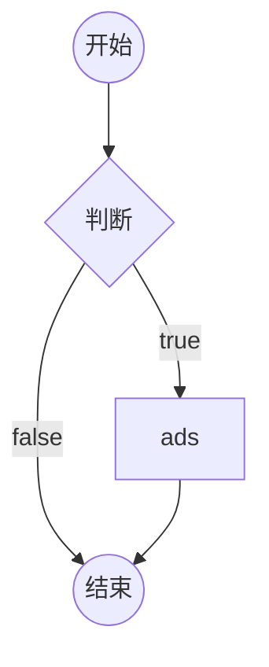
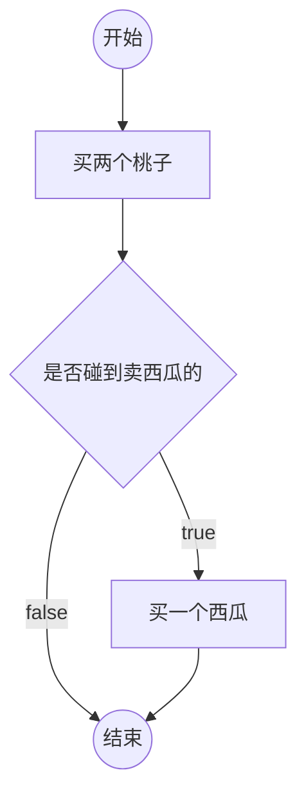
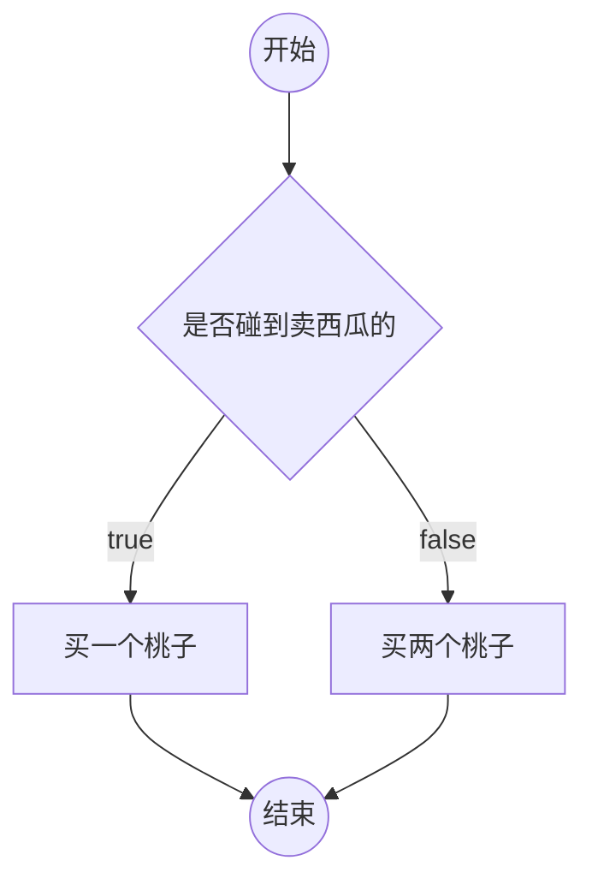

## 4-1. 流程图

- 流程图是啥？
  - 一套标准的图形，用于描述程序的逻辑，通常使用流程图来分析程序的流程。
  - 相关符号：
- 如何在 markdown 中绘制流程图？
  - `mermaid`
  - 很简单，自行百度即可。

---

- [x] 在 markdown 中画流程图的基本语法

```
graph TD
start((开始))-->if{判断}
if{判断}--true-->A[ads]
if{判断}--false-->ed((结束))
A-->ed
```



- [x] 邓哥的思维：

```
graph TD
st((开始)) --> buyPeach[买两个桃子]
buyPeach-->if{是否碰到卖西瓜的}
if--true-->buyXigua[买一个西瓜]
if--false-->ed((结束))
buyXigua-->ed
```



<!--  -->

- [x] 成哥的思维：

```
graph TD
st((开始)) --> if{是否碰到卖西瓜的}
if--true-->买一个桃子
if--false-->买两个桃子
买一个桃子-->ed((结束))
买两个桃子-->ed
```



<!--  -->

