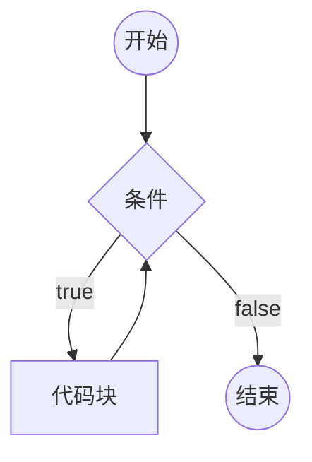
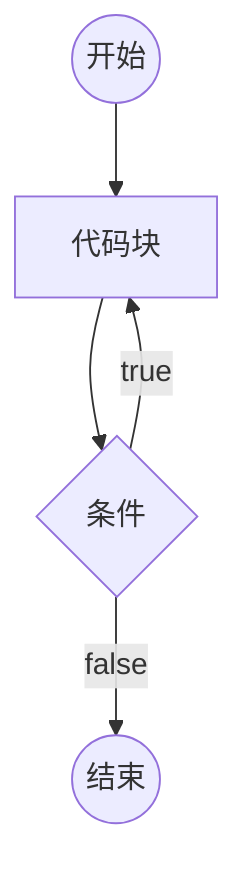
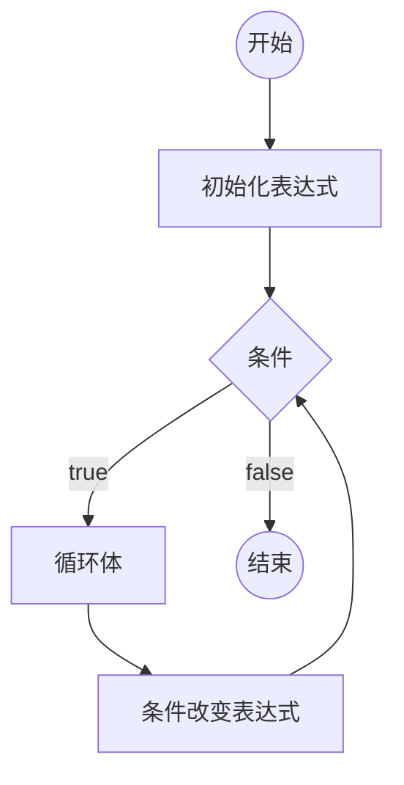

## 4-5. 循环

- 什么是循环体？
  - 循环体就是一段代码，可以是一条语句，也可以是多条语句。
- 什么是循环？
  - 循环就是在循环条件满足的情况下，重复的运行循环体。
- 什么是死循环？
  - 死循环就是循环条件永远满足，永远无法退出循环。
- js 中的循环结构都有哪些？
  - JS支持3种循环结构：while循环、do-while循环、**for循环**。
    - 重点在于 **for循环**。
  - 在学习 es6 之前，只接触到这三种循环结构。后面在我们学习过 es6 之后，还会有 `for-in`、`for-of` 循环结构，这些在 es6 会介绍。
- 循环中的关键字有什么作用？
  - 循环控制语句
- 循环中的关键字有哪些？
  - `break;` 跳出循环
  - `continue;` 停止当前循环体，进入下一次循环。

---

- while循环

```js
while (条件) {
  // 代码块（循环体）
}
```



<!--  -->

- do-while循环

```js
do {
  // 循环体
} while (条件);
```



<!--  -->


- for循环

```js
for (初始化表达式; 条件; 条件改变表达式){
  // 循环体
}
```



<!--  -->

