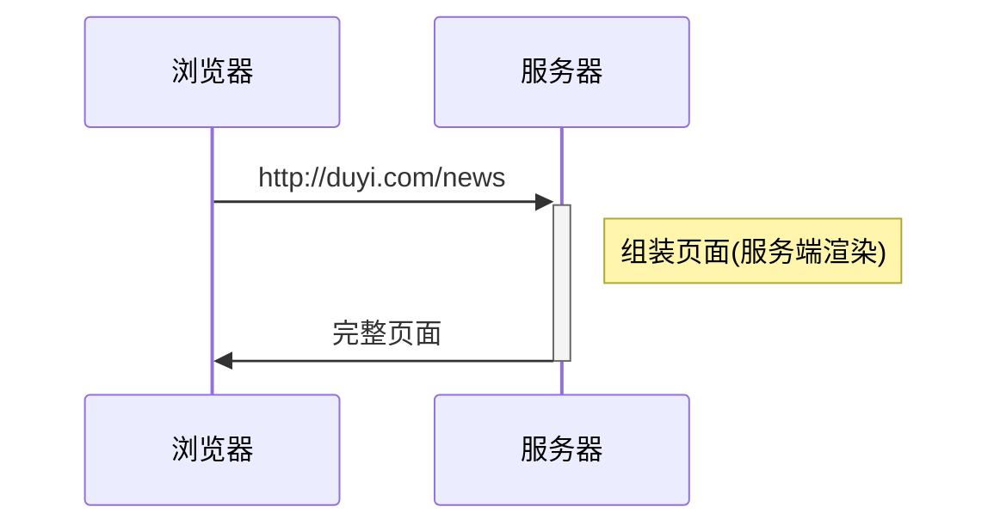
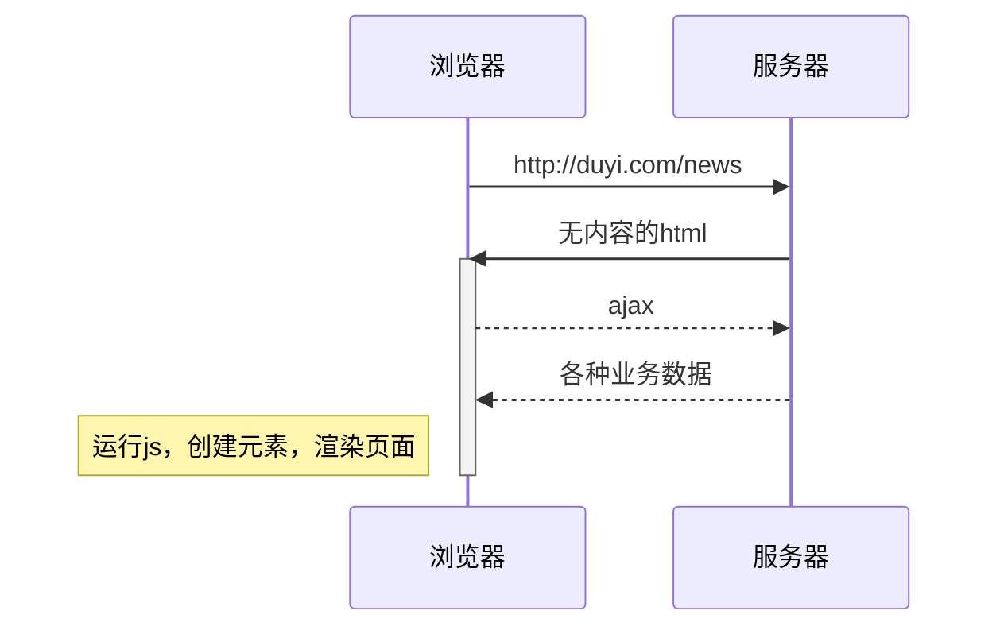
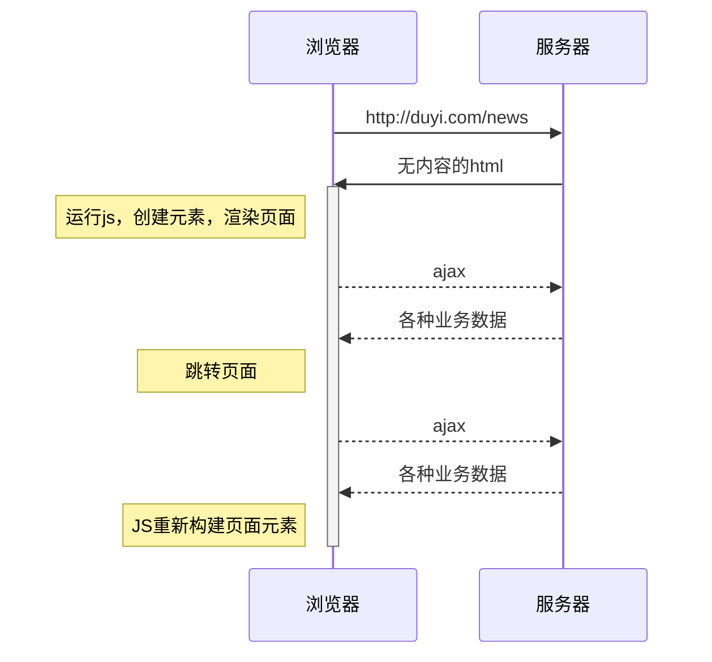
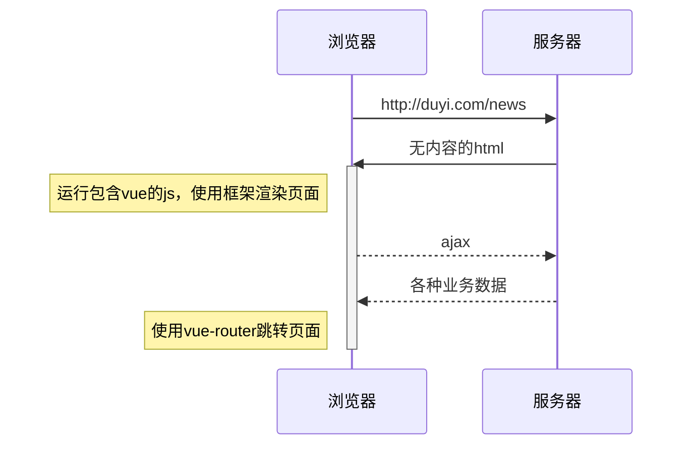

## 01. 前端框架的由来 {ignore}

[toc]

### 前言

- 时长：23min

**summary**

- 了解什么是服务端渲染、前后端分离、单页应用？ => 简单了解一下即可。
- 简单地了解一下 [vue](https://cn.vuejs.org/) 框架帮我们解决的问题是什么？ => 框架是用来降低开发工程的复杂度的。

在讲解本课程时，vue 的最新版本已经是 vue3 了，为啥不直接讲 vue3？

- Vue3 刚推出来不久，生态还没成熟，很多公司不会直接将其应用到项目中；
- 市面上还是有很大一部分的项目是使用 Vue2 来开发的，我们之后到了公司后，可能还得维护之前的项目，那很可能就会用到 Vue2；
- 学会 Vue2 再去看 Vue3，会更容易上手一些；

### 服务端渲染

服务端渲染，SSR（server side render）。这时候还没有前端开发者这一说法，那时候的前端工作者叫页面重构师，即：抠图仔。大量的工作都是由后端工程师来完成的，后端的压力极大。这是由当时的前端架构决定的，所以当时的前端开发者只能干这些活。

### 前后端分离

把一些页面渲染工作推到了前端来做，使用 js 来创建页面元素，实现页面的渲染。前端的工作量在阶段1的基础上加上的页面渲染。

### 单页应用

此时，前端的工作不仅仅是要实现页面重构和页面渲染，还需要实现跳转页面，然后使用 js 来重新构建元素。这一阶段，前端开发者的压力极大，然后出现了框架，用框架，可以降低我们前端开发的复杂度。

### vue 框架

vue 框架，可以帮我们更轻易地实现一个单页应用，降低我们前端开发者实现一个单页应用的复杂度。

**浏览器端的 vue**

现阶段学习的 vue 都是运行在浏览器端的，而非服务器端；但是，这并不是说 vue 不能运行在服务器端。运行在服务器端的 vue，得学习 vue ssr。
