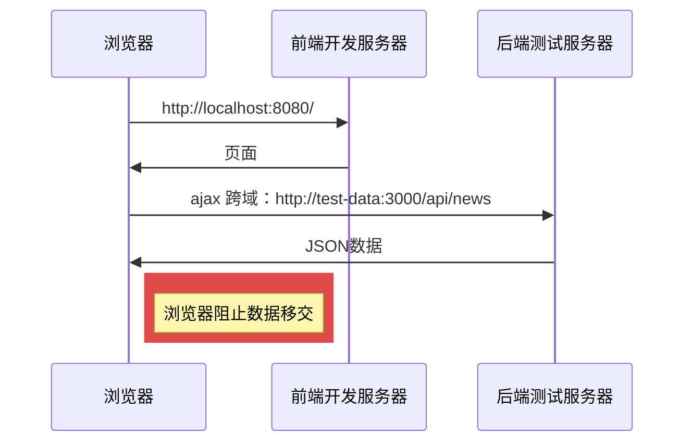
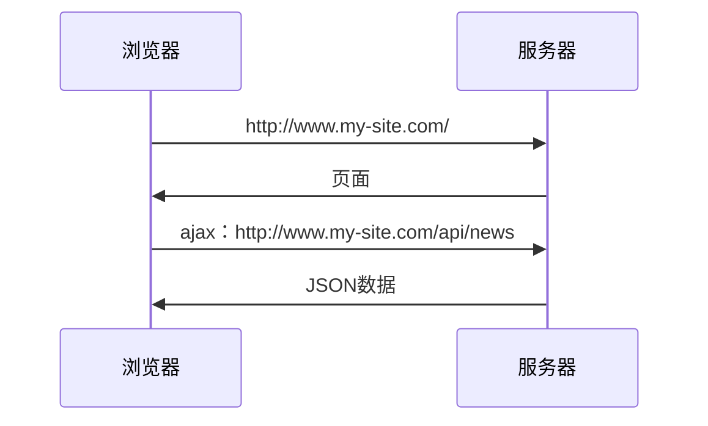
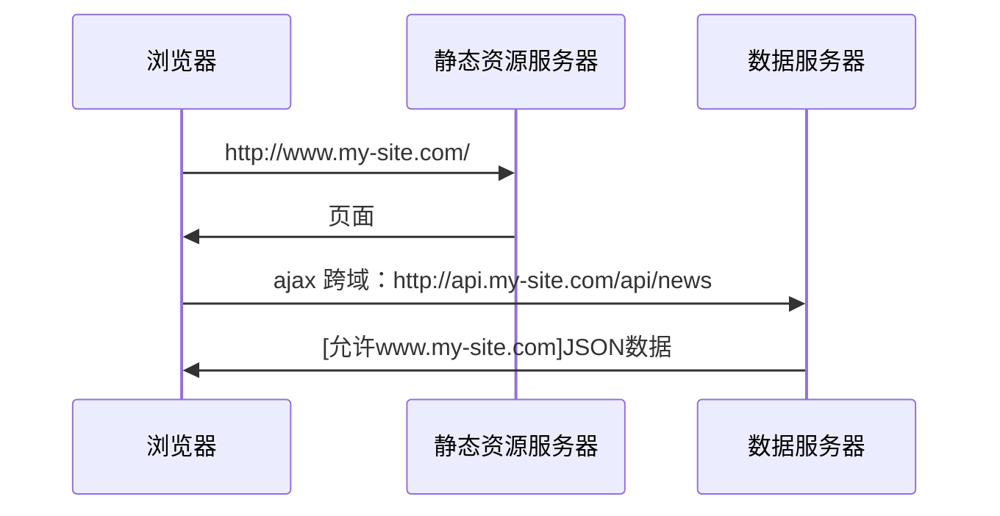
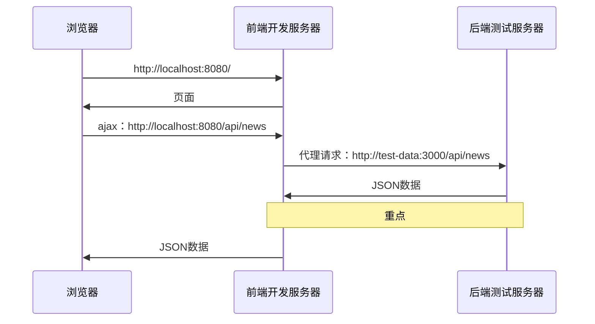
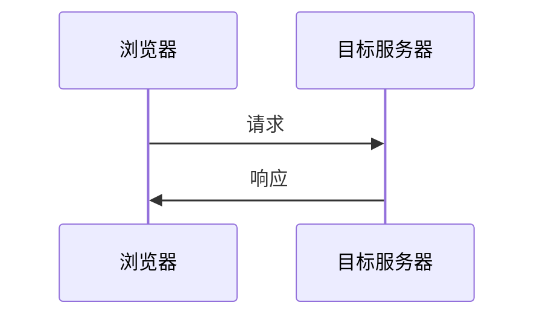
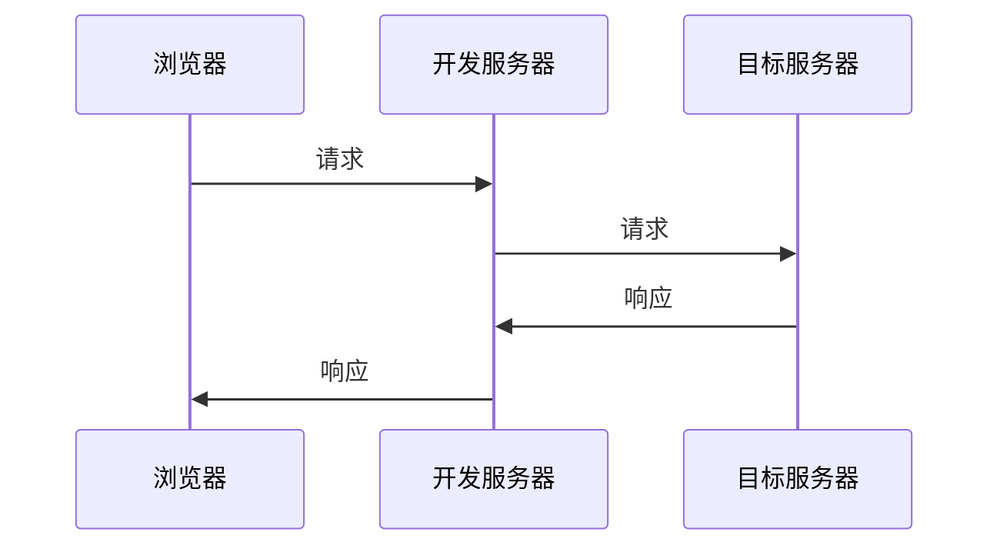
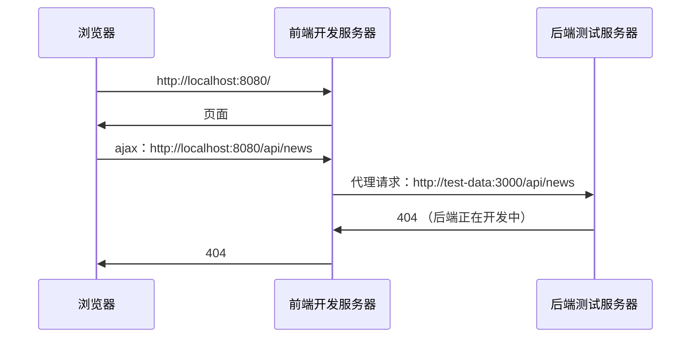
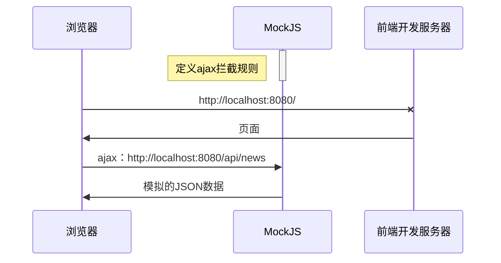

## 13. 获取远程数据 {ignore}

[toc]

### 前言

- 时长：57

**Summary**

mockjs | axios | 跨域问题 | 学会阅读接口文档

本节课程介绍的内容和 vue 没有任何关系（和 vue-cli 有点关系）！讲解的是网络通信的相关知识点，目的是为了解决（Fake Data）模拟虚假数据的问题。因为在很多情况下，我们前端开发时，后端还没有写好接口。此时就需要我们具备这样的能力 —— 在后端的接口还没开发完成的情况下，实现相关的业务需求。而 mockjs 就是专门用来干这事儿的，用它可以很轻易地生成我们需要的一些模拟数据。所以，它将会是本节课的所要介绍的重点。除了 mockjs 之外，我们还必须具备一定的网络相关的知识，比如“跨域问题”；发送请求的工具库 axios；等等。

**sequence**

下面的 markdown 笔记中用到了 [sequenceDiagram](https://plantuml.com/zh/sequence-diagram)，它表示时序图的含义。绘制语法可参考：[PlantUML](https://plantuml.com/zh/)。还有对应的 [pdf](http://plantuml.com/zh/guide) 格式可供下载。

### 简介

#### 最终效果

**目标**

学会使用 axios 工具库，封装该项目用于发送请求的方法；使用 Mock 拦截请求，并返回 mock 生成的模拟数据。

**Attention**

需要考虑错误情况，因为请求是有可能会出现错误的。当数据请求失败时，调用上一节课封装的 showMessage 方法，在页面正中间显示提示弹框，内容为（模拟的）后端响应数据的错误提示信息。

#### 跨域

**概念**

跨域是**浏览器端**的一个同源保护机制。

由此可见，跨域这种问题只会发生来浏览器上，并不会发生在服务器上。如果发出请求的并不是浏览器，而是服务器的话，那么是不可能存在跨域的可能性的。

**跨域发生的条件**

- 协议
- 域名
- 端口号

这 3 个有一个不同，就会发生跨域。

#### 搭建前端开发服务器

前端开发服务器是由谁来搭建的？

前端开发服务器是由 `vue-cli` 帮我们搭建的，`vue-cli` 又是使用 `webpack` 来实现搭建工程的。

#### [vue.config.js](https://cli.vuejs.org/zh/config/#vue-config-js) 配置代理

```js
// vue.config.js
module.exports = {
  devServer: {
    proxy: {
      "/api": {
        target: "https://open.duyiedu.com",
      },
      "xxx": {
        target: "xxx",
      },
    },
  },
};
```

**Attention**

配置文件更新后，需要重新启动工程。

#### [MockJS](http://mockjs.com/)

**Install**

```shell
npm i mockjs
```

**Syntax**

```js
// 使用 Mock 定义拦截规则的语法
// Mock.mock("拦截规则", "请求方式", "数据")
import Mock from "mock";
Mock.mock("/api/bloglist", "get", {
  // ...
})
```

**Attention**

需要运行一遍 js 文件，让拦截规则生效。

**模拟延时**

```js
// 使用 Mock 来模拟请求延迟的时间
import Mock from "mock";
Mock.setup({
  timeout: "1000-2000"
});
```

**mockjs 原理**

mockjs 内部是借助 XMLHttpRequest 来实现的。

#### [Axios](https://github.com/axios/axios)

**Install**

```shell
npm i mockjs
```

```js
import axios from "axios";
import {
  showMessage
} from "../utils";

const ins = axios.create();

// 拦截响应
ins.interceptors.response.use((resp) => {
  if (resp.data.code !== 0) {
    showMessage({
      content: resp.data.data,
      type: "error",
      duration: 1500,
    });
    return null;
  }
  return resp.data.data;
});

export default ins;
/* resp.data.code !== 0
  表示请求发生了错误，这是接口文档的规定。（本节提供了一个接口文档，一个 markdown 文件，在本节目录中即可查看。）
  使用 axios 实例，来定义拦截响应的事件处理函数。由于请求已经由 Mock 来拦截了，所以这里只要创建好拦截器来处理响应即可。
  上述写法的作用，我们可以简单的理解为“代理”，就是我们使用 axios 来对服务器响应的内容做了一层代理，在我们获取到服务器响应的内容时，都要先经过这层代理才行。
  */
```

#### @/mock 目录结构

```
|
|-- index.js
|-- banner
    |-- index.js # 模拟首页的数据
# 按照上面这种方式来划分目录结构，可以有效的降低耦合。以便后期维护。
```

```js
// ./mock/index.js
import "./banner"; // 模拟 Home 的所有数据
import "./blog"; // 模拟 Blog 的所有数据
// ...
// 比如说，如果后端已经实现了 Home 的所有接口，我们只要将语句 import "./banner"; 给注释掉即可。
```

```js
// main.js
import "@/mock";
// main.js 中只要写一条语句
```

#### 执行指定 js 文件

下面要介绍的应该是模块化相关的知识，就是对导入的理解。**导入，其实就意味着将指定的 js 文件执行了一遍**。可见，执行指定的 js 文件，其实也就是导入指定的 js 文件。

**fetch**

```js
fetch("https://open.duyiedu.com/api/student/findAll?appkey=_abc123_1606358542486")
    .then(resp => resp.json())
    .then(result => console.log(result));
// 使用 h5 提供的 fetch api 来向该接口发起请求，将请求到的数据打印出来。
// 这段代码，直接搬运到浏览器的控制台，即可执行。
// https://open.duyiedu.com/api/student/findAll?appkey=_abc123_1606358542486
// 这是一个用于在线测试的接口 —— 学生信息管理系统的在线测试接口（查询所有学生）
```

**执行 js 文件**

```js
// @/test.js
fetch("https://open.duyiedu.com/api/student/findAll?appkey=_abc123_1606358542486")
    .then(resp => resp.json())
    .then(result => console.log(result));
// 在 vue 项目中，若我们想要执行一遍 test.js 文件中的这段代码，应该怎么做呢？
// 只要将其导入到 main.js 中即可。
// PS：导入一个模块，就会执行一遍模块中的代码，这是很基础的知识。所以，我们的目标只是执行这一段代码，其实也可以不在 main.js 中导入。在 App.vue 中导入也是 OK 的。因为 main.js 中导入了 App.vue，所以 App.vue 必然会执行；若 App.vue 中又导入了 test.js，那么 test.js 自然也会被执行。
```


### 远程获取数据的意义


**前台 | 后台**

实际上，该个人博客系统开发完成后，是分前台和后台的。**前台**面向的对象是**用户**，**后台**面向的对象是**管理员**。我们现在在开发的是前台。

后台负责维护和更新数据，这样我们就不用手动到服务器、数据库中修改数据了；前台则主要负责从服务器、数据库获取最新的相关数据，展示给用户看，并实现一些简单的交互效果。

由此可知，后台 | 前台，两个部分都要获取远程数据。在形成这样一个闭环后，数据的维护、更新、展示就会变得更容易一些。方便管理和维护，这就是我们为何要远程获取数据的原因。

### 开发环境有跨域问题



**流程**

- 浏览器通过地址 `http://localhost:8080/` 访问前端开发服务器。
- 前端开发服务器接收到浏览器发送过来的请求之后，将相关的资源返回，其中包括 html、css、js、图片 等相关资源。
- 浏览器执行 js 文件，向指定的地址 `http://test-data:3000/api/news` 发送 ajax 请求。
- 后端测试服务器在接收到请求之后，也会将相关的数据返回，并且浏览器也是能够接收到的。
- 但是，浏览器接收到这些资源后，判定跨域了，浏览器阻止数据移交，自然就不会把这些数据交给我们。

**Attention**

跨域这一行为，是发生在浏览器上的。

### 生产环境没有跨域问题

正常情况下，生产环境是不存在跨域问题的。下面是常见的生产环境的两种情况。（特例暂时不考虑）

**Case 1**



请求的都是同一个地址，协议、域名、端口号都相同。所以，在这种情况下，不存在跨域的问题。

**Case 2**



请求的不是同一个地址，但是，后端服务器帮我们处理了跨域问题。

**静态资源服务器**

可能是一个 cdn，也可能是我们后面学习了 nodejs 后，使用 nodejs 开发的“中间服务器”。可以将静态资源服务器理解为一个“代理”（中间商），作用就是转发请求，可能还会有一些简单的业务逻辑的处理。

### 解决开发环境的跨域问题



**原理**

很简单，就是走代理。我们知道，跨域这一行为，是发生在浏览器端的，但是，对于服务器而言，是不存在什么跨域问题的。知道了这点，我们就可以让前端开发服务器去帮我们向后端服务器请求数据，等到前端开发服务器请求到数据之后，我们再从前端开发服务器获取数据。

**配置**

如何设置前端开发服务器，让它成为代理？

需要在 vue-cli 的配置文件 [vue.config.js](https://cli.vuejs.org/zh/config/#devserver-proxy) 中配置，配置方式和 webpack 相同。

**Usage**

```js
// vue.config.js vue-cli的配置文件
module.exports = {
  devServer: {
    proxy: {
      "/api": {
        target: "https://open.duyiedu.com",
      },
      "/commercial_api": {
        target: "https://www.zhihu.com"
      }
    },
  },
};
```

**Attention**

更新配置文件后，需要重新启动工程。

```js
// test.js
import axios from "axios";

async function getInfo(url) {
  const resp = await axios.get(url);
  console.log(resp);
}

getInfo('/commercial_api/banners_v3/home_up'); // 获取知乎的相关数据
getInfo('/api/student/findAll?appkey=_abc123_1606358542486'); // 获取所有学生信息
// http://localhost:8080/commercial_api/banners_v3/home_up
//   如果像这样写死的话，那么之后部署的时候，还需要将协议、域名、端口号修改为与服务器的协议、域名、端口号相同。
// /commercial_api/banners_v3/home_up
//   协议、域名、端口号不写，默认会与本机相同，这么写的好处在于，之后部署的时候，就不需要修改了。
```


**设置代理前**




**设置代理后**




### 为什么要 Mock 数据

为了前后端开发同时进行。当后端还没开发完，前端无法获取到后端的数据时，就需要使用 Mock 来模拟一些假的数据。学会使用 Mock，可以让我们的前端开发不受限于后端提供的接口。

在后端还没有给我们接口的情况下，我们通常有以下应对措施。

**方法1 - 后端测试服务器**



**方法2 - 使用 Mock 模拟接口返回的数据**



**Attention**

Mock 实际上就是运行在浏览器上的，不要把它理解为一个服务器。

### Mock 模拟数据的实现流程

**第一步：定义拦截规则**

```js
// @/mock/banner/index.js
import Mock from 'mockjs'

Mock.mock("/api/banner", "get", {
  code: 0,
  msg: "",
  data: [{
    id: "1",
    midImg: "http://mdrs.yuanjin.tech/img/20201031141507.jpg",
    bigImg: "http://mdrs.yuanjin.tech/img/20201031141350.jpg",
    title: "凛冬将至",
    description: "人唯有恐惧的时候方能勇敢",
  },
  {
    id: "2",
    midImg: "http://mdrs.yuanjin.tech/img/20201031205550.jpg",
    bigImg: "http://mdrs.yuanjin.tech/img/20201031205551.jpg",
    title: "血火同源",
    description: "如果我回头，一切都完了",
  },
  {
    id: "3",
    midImg: "http://mdrs.yuanjin.tech/img/20201031204401.jpg",
    bigImg: "http://mdrs.yuanjin.tech/img/20201031204403.jpg",
    title: "听我怒吼",
    description: "兰尼斯特有债必偿",
  },
  ]
});
/* Mock.mock("拦截规则", "请求方式", "数据")
  参数可以参照接口文档来填写。 */
```

**Attention**

接口文档是提前给出的，前后端都按照接口文档来完成开发。


```js
// @/mock/index.js
import "./banner"
import Mock from "mockjs"

Mock.setup({
  timeout: "1000-2000",
});
/*
import "./banner"
  执行一遍这个文件中的代码，让拦截规则生效。
timeout: "1000-2000",
  表示延迟 1~2 秒后，请求到数据。 */
```

**第二步：发送请求进行测试**

```js
// @/api/test.js
import axios from "axios";

async function getInfo(url) {
  const resp = await axios.get(url);
  console.log(resp);
}

getInfo('/api/banner'); // banner
/*
getInfo('/api/banner');
  因为第一步定义了拦截规则，所以这个请求将被 Mock 拦截，并不会发出。
resp
  这里获取到的 resp 包含响应头和响应体
    resp.data 表示的就是响应体，内容就是调用 Mock.mock 传入的第 3 个参数。
    resp.data.data 获取到业务数据。
 */
```

### 封装请求方法

封装一个 axios 实例。

```js
// @/api/request.js
import axios from "axios";
import {
  showMessage
} from "../utils";

const ins = axios.create();

ins.interceptors.response.use((resp) => {
  if (resp.data.code !== 0) {
    showMessage({
      content: resp.data.msg,
      type: "error",
      duration: 1500
    });
    return null;
  }
  return resp.data.data;
});

export default ins;
/*
const ins = axios.create();
  创建一个 axios 的实例，但凡是 axios 上能使用的 api，axios 的实例 ins 都能使用。
ins.interceptors.response.use(func)
  创建一个拦截器，但凡是使用 axios 的实例 ins 发出的请求所接收到的响应，在将响应的结果返回前，都会先运行一遍 func。
  函数 func 接收到的第一个参数是请求到的 response 对象，通过 response.data 即可获取到响应体中的数据。
    返回值
    func 函数的返回值将作为 axios 实例 ins 调用请求接口所得到的数据。
    也就是在下面这个 test.js 中所写的 `request.get(url);`
resp.data.code !== 0
  表示数据请求失败
  弹出请求失败的提示信息，并模拟接口规范返回 null。
*/
```

```js
// @/api/test.js
import request from './request';

async function getInfo(url) {
  return await request.get(url);
}

getInfo('/api/banner'); // banner
```

**bug**

修改 showMessage.js，之前写的 showMessage.js 出了点小问题，测试阶段发现了一个 bug，不能直接给 body 添加相对定位，否则会在页面顶部显示弹出消息。

```js
// 将 div 加入到容器中
if (options.container) { // 若把 body 设置为 position: relative; 那么会出问题。
  if (getComputedStyle(container).position === "static") {
    container.style.position = "relative";
  }
}
container.appendChild(div);
```

测试：修改一下模拟的后端返回的数据，测试一下错误信息是否能够正常弹出。


